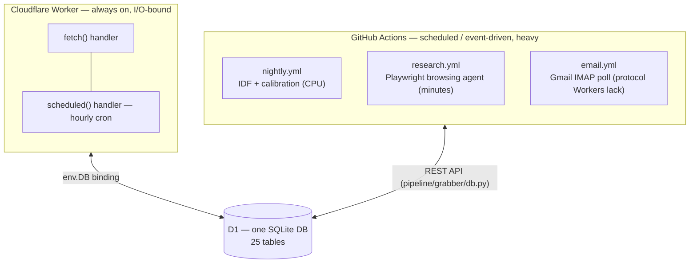
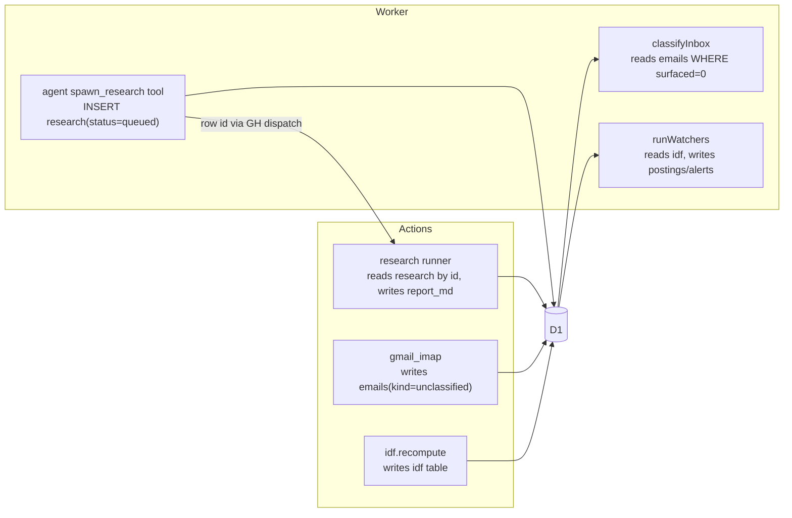
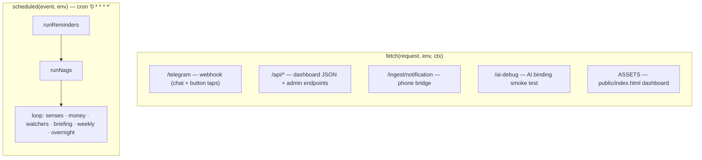
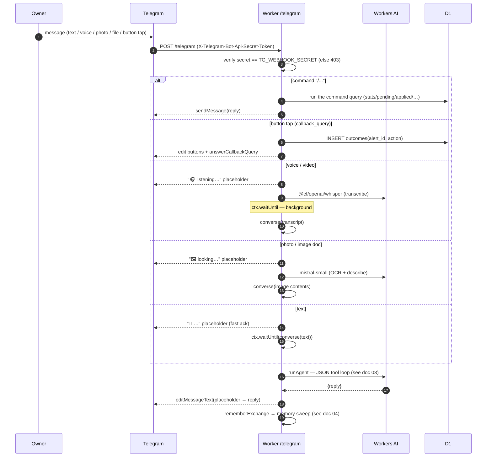
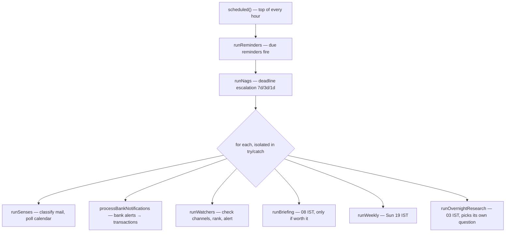
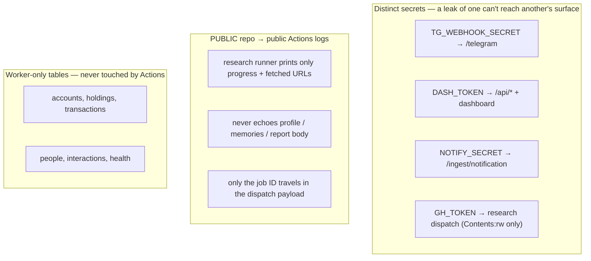
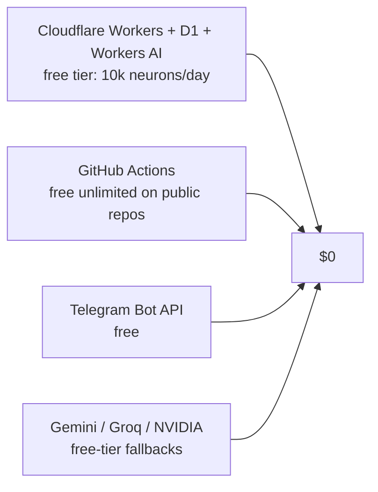
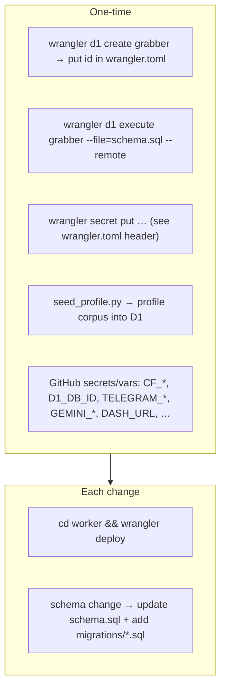

# 1. High-Level Design

## 1.1 The core idea: two runtimes, one database

grabber deliberately splits into **two execution environments that share a single D1
(SQLite) database**. The split is not arbitrary — it maps exactly onto the constraint
"what actually needs a real machine?"

**Why the Worker holds almost everything.** Watchers, ranking, drafting, alerts, the
chat agent, memory, senses, money, initiative and the dashboard are all I/O-bound
(network + DB + LLM calls). A Cloudflare Worker is always on, has zero cold-start cost,
and gets the `AI` binding for free — so it is the natural home. See
`worker/src/index.js` and every module it imports.

**Why anything runs in GitHub Actions.** Only three jobs cannot live in a Worker
(`pipeline/grabber/main.py:1`):

| Job | Why it can't be a Worker |
|-----|--------------------------|
| **IDF recompute** | Tokenises the whole `postings` corpus and counts document frequency — more CPU than a Worker invocation gets. `pipeline/grabber/rank/idf.py` |
| **Deep research** | Browses for 5–15 minutes with a headless Chromium; a Worker has no browser and short wall-clock limits. `pipeline/grabber/research/runner.py` |
| **Gmail poll** | Speaks **IMAP**, which Workers cannot. `pipeline/grabber/gmail_imap.py` |

Everything else — including *classifying* the mail that IMAP fetched — happens in the
Worker.

## 1.2 The shared database as the integration bus

There is no direct RPC between the two runtimes. **D1 is the message bus.** Both sides
speak SQLite; they coordinate by reading and writing rows.

Two access paths to the same DB:

- **Worker** → the `DB` binding, e.g. `env.DB.prepare(sql).bind(...).all()`. Configured
  in `worker/wrangler.toml:20` (`binding = "DB"`, `database_name = "grabber"`).
- **Python** → D1's HTTP REST API, wrapped in `class D1` at `pipeline/grabber/db.py:9`.
  It POSTs `{sql, params}` to `.../d1/database/<id>/query`, retries `429`/`5xx` with
  exponential backoff, and raises on failure. Authenticated with the same
  `CF_ACCOUNT_ID` / `CF_API_TOKEN` used for the AI binding.

**A concrete cross-runtime handoff — `spawn_research`:** the agent inserts a `research`
row (`status='queued'`), then fires a GitHub `repository_dispatch` carrying only the
**row id** (`worker/src/agent.js:313`). The Actions runner reads the question from D1 by
that id, works, and writes `report_md` / `status='done'` back. The id is all that
travels through the (public) dispatch payload — see §1.6.

## 1.3 The Worker: two entry points

`worker/src/index.js` exports exactly two handlers (`worker/src/index.js:823`):

The routing logic (`worker/src/index.js:823-861`): `/ai-debug` and `/ingest/notification`
are checked first, then `/telegram`, then any `/api/` prefix, and everything else falls
through to static assets (the dashboard HTML, served with `Cache-Control: no-cache` so a
redeploy is never masked by a stale cached copy).

Full route and cron detail is in [08-api-and-ops.md](./08-api-and-ops.md).

## 1.4 Request flow: an owner sends a Telegram message

The webhook is designed to **acknowledge Telegram instantly and think in the
background** — Telegram retries a webhook that doesn't answer in seconds, which would
double-process the message.

Key implementation facts:

- **Ownership gate:** every non-`/start` interaction checks `isOwner(chatId, env)` —
  `String(chatId) === String(env.TELEGRAM_CHAT_ID)` (`worker/src/index.js:159`). A
  stranger gets *"I'm a personal agent working for one person, and it isn't you. 🙂"*.
- **Placeholder pattern:** the Worker sends a fast placeholder ("🤔 …"), does the slow
  work under `ctx.waitUntil(...)`, then edits the placeholder into the real reply
  (`worker/src/index.js:398`, `converse` at `:295`).
- **Multimodality** is all Workers AI: Whisper for audio (`transcribe`, `:197`), Mistral
  for image OCR (`describeImage`, `:218` — chosen because llava's OCR is too weak and
  llama-3.2-vision is license-gated), and any text file becomes profile corpus
  (`ingestDocument`, `:324`).
- **HTML-safety fallback:** if `sendMessage`/`editMessageText` fails (usually the model
  emitted HTML-unsafe text), the Worker resends with `parse_mode` stripped
  (`worker/src/index.js:308`).

## 1.5 The hourly cron: how the agent acts unprompted

One cron trigger, `"0 * * * *"` (`worker/wrangler.toml:27`), drives all initiative.
Order matters and is deliberate (`worker/src/index.js:862`):

- **Failure isolation:** reminders and nags run first (they are cheap and must never be
  starved), then the six initiative jobs run inside a `for` loop where **each is wrapped
  so one failing never stops the others** (`worker/src/index.js:866-881`). Briefing runs
  after senses/money/watchers because it *reports on* them.
- **Self-gating by clock:** the cron fires hourly, but `runBriefing`/`runWeekly`/
  `runOvernightResearch` each check the IST hour themselves and no-op unless it's their
  time (`worker/src/briefing.js:160`, `:222`, `:292`). This is why there is only one
  cron expression for many differently-timed jobs.
- **Idempotency:** nags gate each escalation level with `alerts.nag_level`
  (`worker/src/index.js:466`); briefings gate on a `state` row (`briefing_last = today`)
  so re-firing the same hour does nothing.

## 1.6 Security and privacy boundaries

The repo is **public**, which drives several hard rules.

- **Separate secrets per surface** (`worker/wrangler.toml:29-40`): the phone bridge has
  its own `NOTIFY_SECRET` so a leaked `DASH_TOKEN` can't inject into the agent's senses
  (`worker/src/index.js:835`). The Telegram webhook validates
  `X-Telegram-Bot-Api-Secret-Token` (`:356`).
- **Public-log discipline:** `research.yml` and `runner.py` are explicitly forbidden from
  printing owner content; only the job id crosses the dispatch boundary
  (`.github/workflows/research.yml:6-11`, `pipeline/grabber/research/runner.py:1-7`).
- **`profile/` never enters git** — it's gitignored and lives only in D1, seeded by
  `pipeline/scripts/seed_profile.py` (`.gitignore`, top of the file).
- **The money/body/people domain is Worker-only.** `worker/src/life.js:1-7` states the
  boundary: no Actions job may read or write those tables while the repo is public,
  because that's where the owner's bank balance lives.
- **Untrusted web text:** the research agent treats every fetched page as untrusted data
  and is told to disobey embedded instructions (`runner.py:41-44`, `:192`).

## 1.7 Cost model — why it's $0

The primary LLM is Workers AI `@cf/openai/gpt-oss-120b` (~10k free neurons/day). Free-tier
rate is the real budget, which is why the whole opportunity engine is built around
*spending model calls sparingly*: a cheap non-LLM recall stage cuts candidates before any
LLM read, and there is a hard 2-alerts/day cap (see [05-opportunity-engine.md](./05-opportunity-engine.md)).

## 1.8 Deployment

There is **no test suite and no linter**. Verify the Worker with `wrangler dev` /
`wrangler tail`; verify the pipeline by running `python -m grabber.main <cmd>` against a
dev D1. The Worker also exposes manual-trigger endpoints (`/api/cron`, `/api/tool`,
`/ai-debug`) for testing without waiting for the real cron — see
[08-api-and-ops.md](./08-api-and-ops.md).
