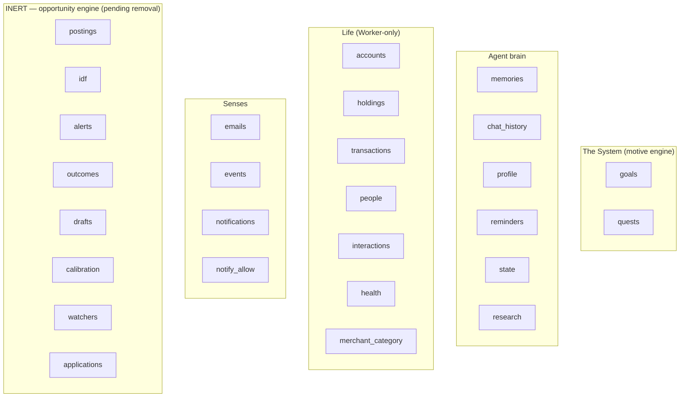
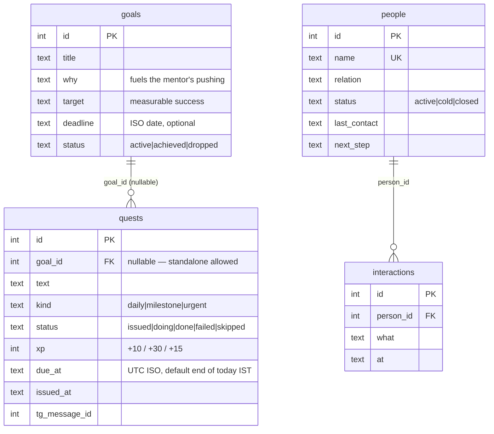

# 2. Data Model

The entire system state lives in **one D1 (SQLite) database**. `schema.sql` is the source
of truth; `migrations/` holds incremental DDL. This doc maps every table, who owns it, and
how they relate.

> **The System refactor (2026-07-18):** the opportunity engine was replaced by The System
> (see [05-the-system.md](./05-the-system.md)). Two tables were **added** — `goals` and
> `quests` (`migrations/002_the_system.sql`). Six tables are now **inert** (no code reads
> or writes them): `postings`, `idf`, `alerts`, `outcomes`, `drafts`, `calibration`. They
> are intentionally left in `schema.sql` for one more cleanup pass so the existing
> dashboard keeps querying without error; a later migration will drop them.

> **Schema-drift rule, straight from the code:** tables reached production as hand-run DDL
> across phases and were not always written back to `schema.sql`. **Any schema change now
> updates `schema.sql` *and* adds a `migrations/NNN_*.sql`.** To re-sync from prod:
> `wrangler d1 execute grabber --remote --command "SELECT sql FROM sqlite_master"`.

## 2.1 The tables by domain

(`applications` from `apply.js` is kept and live — the mentor's "draft me an application"
lever — it just sits next to the inert board tables above.)

## 2.2 Entity relationships (the connected core)

Most tables are standalone key-value or log tables; these are the ones with real foreign
keys and join paths.

XP / level / streak are not a table — they live as `state` rows (`xp`, `level`, `streak`,
`streak_best`). See [05-the-system.md](./05-the-system.md).

## 2.3 Table reference

### The System
| Table | Purpose | Written by | Key notes |
|-------|---------|-----------|-----------|
| `goals` | The owner's real objectives | `system.js` (`set_goal`, chat) | `status` `active\|achieved\|dropped`; cached `progress` `0..1` recomputed on quest/milestone change; everything is judged against active goals. |
| `milestones` | The persistent **roadmap** per goal | `planGoal()` in `system.js` | ordered `seq`; `done_when`, `target_date`, `status` `pending\|active\|done\|skipped`. Daily quests aim at the goal's `active` milestone. |
| `quests` | Concrete done-tonight tasks | `system.js` (`issueDaily`, `add_quest`) | `milestone_id` links the quest to the milestone it advances; `status` `issued→doing→done\|failed\|skipped`; `xp` by kind; resolution moves XP + streak + progress. |
| `activity` | The System's work log | `logActivity()` in `system.js` | `actor` `owner\|system`; `reasoning` (why, for autonomous moves); `kind` adds `plan\|milestone_done\|autonomous\|metric`. Powers the dashboard feed via `/api/system`. |
| `metrics` | Arbitrary numbers tracked over time | `logMetric()` (agent tool `log_metric`) | `name` (lowercased series key), `value`, `unit`, optional `goal_id`; charted per-name on the dashboard's System tab. |

### Agent brain
| Table | Purpose | Key notes |
|-------|---------|-----------|
| `memories` | Durable facts about the owner | `embedding` = base64 Float32 (384-dim, normalised); `source` = chat\|auto\|backfill; `context` = provenance. See [04-memory.md](./04-memory.md). |
| `chat_history` | Rolling raw conversation | Compacted into `profile.conversation_summary` beyond a window (`agent.js`). |
| `profile` | The private corpus | keys: `resume`, `bio`, `skills`, `conversation_summary`, `doc:*`, `essay:*`. Read by the agent, quest generation, and `apply.js`. |
| `reminders` | General reminders | `due_at` is **UTC ISO**; fired by hourly cron. |
| `state` | Key-value scratch | `persona`, `perception`, and The System's `xp`/`level`/`streak`/`streak_best`/`system_last_issue`/`system_last_debrief`. |
| `research` | Deep-research jobs | state machine `queued→running→done/failed`; `report_md`, `sources` (JSON), `depth`. |
| `applications` | On-demand application **packs** (live) | `apply.js` | `fit` is 0–10 (honest "should you apply"); status `ready→…→offer/rejected/dropped`. The mentor's "draft me an application" lever. |

### Inert — opportunity engine (pending removal)
No code reads or writes these; left in place so the current dashboard keeps querying.
`postings`, `idf`, `alerts`, `outcomes`, `drafts`, `calibration`, `watchers`. See
[05-the-system.md §5.8](./05-the-system.md).

### Life — **Worker-only** (see boundary in `life.js:1-7`)
| Table | Purpose | Key notes |
|-------|---------|-----------|
| `accounts` | Bank/wallet/investment/card balances | `net_worth` treats `kind='card'` as money owed. |
| `holdings` | Assets & liabilities | `kind ∈ {asset, liability}`. |
| `transactions` | Money movements | `source ∈ {notification, manual, email}`; category from `merchant_category` or one LLM call. |
| `merchant_category` | Learned merchant→category map | Ask the LLM once, remember forever (`life.js:18`). |
| `people` | The owner's relationships | `status`, `next_step`, `last_contact` drive cold-thread detection. |
| `interactions` | Log per person | Updates `people.last_contact` + resets status to active. |
| `health` | Body metrics over time | weight/waist/sleep/run_km/workout; trends computed on read. |

### Senses
| Table | Purpose | Key notes |
|-------|---------|-----------|
| `emails` | Recruiter/opportunity mail | Written by `gmail_imap.py` as `kind='unclassified'`; Worker classifies + sets `surfaced=1`. |
| `events` | Google Calendar events | Upserted by `pollCalendar`; `reminded` gates the 45-min nag. |
| `notifications` | Allowlisted phone notifications | Money parsed by regex at ingest; `surfaced=0` until `life.js` turns bank ones into transactions. |
| `notify_allow` | The notification allowlist | Nothing is stored unless its app matches a pattern here (privacy default = drop). |

## 2.4 The `applications.fit` score

The one remaining "fit" is `applications.fit` (0–10), produced by `draft_application`
(`apply.js`) when the owner hands the agent a JD/URL and asks for a pack. It answers
"should the owner even apply?" and is shown honestly — a low fit means *don't bother*.
This is a **pull** feature (the owner initiates), now framed as a mentor lever for clearing
a barrier to a goal; see [03-agent.md](./03-agent.md#the-apply-tools). (The old 0–100
`alerts.fit` produced by the removed watcher ranker is gone.)

## 2.5 Practical D1 constraints the code works around

- **Max 100 bound params per statement.** Kept in mind for any batch insert; The System's
  writes are single-row so they don't hit it.
- **No server-side `now()` trust for timezones.** All timestamps are stored UTC ISO;
  IST conversion is done in code (`localNow` in `agent.js`, `ist` in `system.js` and
  `briefing`-style helpers) — see [03-agent.md](./03-agent.md) and
  [05-the-system.md](./05-the-system.md).
- **`RETURNING id`** is used throughout to get autoincrement ids in one round-trip
  (e.g. `goals`, `quests`, `research`, `applications`, `memories`).
