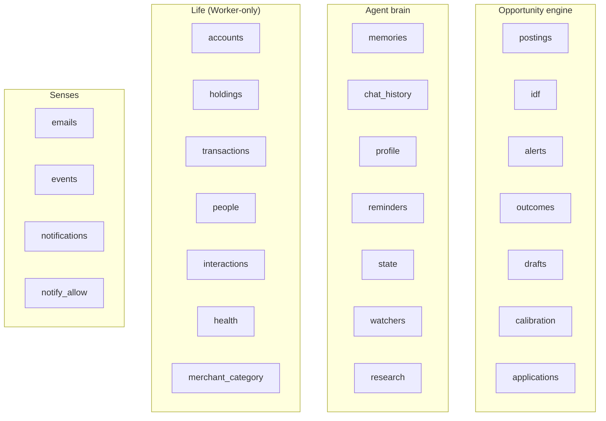
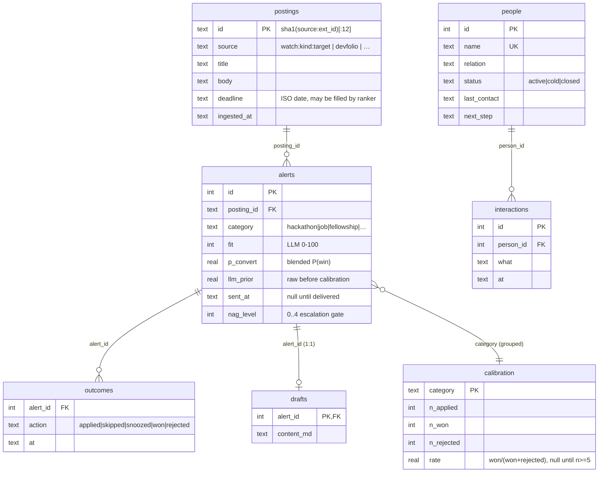
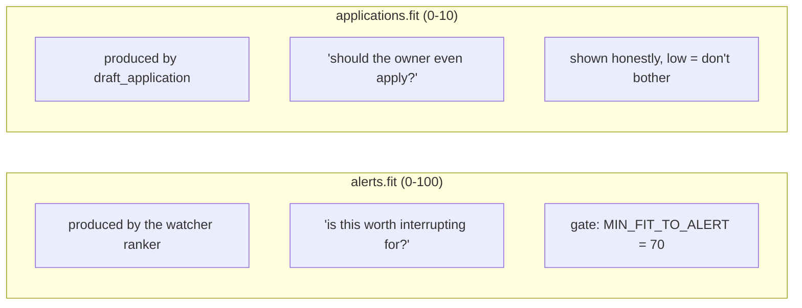

# 2. Data Model

The entire system state lives in **one D1 (SQLite) database, 25 tables**. `schema.sql`
is the source of truth; `migrations/` holds incremental DDL. This doc maps every table,
who owns it, and how they relate.

> **Schema-drift warning, straight from the code:** tables reached production as
> hand-run DDL across phases 3–6 and were not written back to `schema.sql` — a DB built
> from the old file was missing 15 of 25 tables. They were dumped back verbatim from the
> live DB on 2026-07-17 (`schema.sql:108-114`). **Rule going forward:** any schema change
> updates `schema.sql` *and* adds a `migrations/NNN_*.sql`. To re-sync from prod:
> `wrangler d1 execute grabber --remote --command "SELECT sql FROM sqlite_master"`.

## 2.1 The tables by domain

## 2.2 Entity relationships (the connected core)

Most tables are standalone key-value or log tables; these are the ones with real foreign
keys and join paths.

## 2.3 Table reference

### Opportunity engine
| Table | Purpose | Written by | Key notes |
|-------|---------|-----------|-----------|
| `postings` | Every ingested item (the corpus) | `watch.js` (as `watch:<kind>:<target>`) | `id = sha1(source:external_id)[:12]`; `UNIQUE(source, external_id)` makes ingest idempotent. Also the IDF corpus. |
| `idf` | Measured term rarity | `idf.py` (nightly) | `idf = log((n+1)/(d+1))`; unigrams with `df>=2` plus `phrase:<skill>` rows. Rebuilt whole each night. |
| `alerts` | Every alert = a logged **prediction** | `watch.js` | Stores `llm_prior` (raw) and `p_convert` (calibration-blended). `sent_at` null until delivered. |
| `outcomes` | Every button tap = a **label** | `index.js` webhook | append-only; `applied/skipped/snoozed/won/rejected`. |
| `drafts` | Pre-written application material (1 per alert) | `watch.js`, `agent.js redraft` | `content_md` markdown pack. |
| `calibration` | Measured hit-rate per category | `calibrate.py` (nightly) | `rate` stays null until `n>=5` decided; blended into future `p_convert`. |
| `applications` | On-demand application **packs** (separate from alerts) | `apply.js` | `fit` here is 0–10 (honest "should you apply"); status pipeline `ready→…→offer/rejected/dropped`. |

### Agent brain
| Table | Purpose | Key notes |
|-------|---------|-----------|
| `memories` | Durable facts about the owner | `embedding` = base64 Float32 (384-dim, normalised); `source` = chat\|auto\|backfill; `context` = provenance. See [04-memory.md](./04-memory.md). |
| `chat_history` | Rolling raw conversation | Compacted into `profile.conversation_summary` beyond a window (`agent.js:629`). |
| `profile` | The private corpus | keys: `resume`, `bio`, `skills`, `conversation_summary`, `doc:*`, `essay:*`. Read by ranker, agent, drafts. |
| `reminders` | General reminders | `due_at` is **UTC ISO**; fired by hourly cron. |
| `state` | Key-value scratch | `persona`, `perception`, `briefing_*`, `weekly_last`, `overnight_last`, `briefing_text`. |
| `watchers` | Channels the owner asked to watch | `kind ∈ {x, rss, page, search}`; `UNIQUE(kind, target)`; tracks `last_checked`, `last_error`, `hits`. |
| `research` | Deep-research jobs | state machine `queued→running→done/failed`; `report_md`, `sources` (JSON), `depth`. |

### Life — **Worker-only** (see boundary in `life.js:1-7`)
| Table | Purpose | Key notes |
|-------|---------|-----------|
| `accounts` | Bank/wallet/investment/card balances | `net_worth` treats `kind='card'` as money owed. |
| `holdings` | Assets & liabilities | `kind ∈ {asset, liability}`. |
| `transactions` | Money movements | `source ∈ {notification, manual, email}`; category from `merchant_category` or one LLM call. |
| `merchant_category` | Learned merchant→category map | Ask the LLM once, remember forever (`life.js:18`). |
| `people` | The owner's relationships | `status`, `next_step`, `last_contact` drive cold-thread detection. |
| `interactions` | Log per person | Updates `people.last_contact` + resets status to active. |
| `health` | Body metrics over time | weight/waist/sleep/run_km/workout; trends computed on read. |

### Senses
| Table | Purpose | Key notes |
|-------|---------|-----------|
| `emails` | Recruiter/opportunity mail | Written by `gmail_imap.py` as `kind='unclassified'`; Worker classifies + sets `surfaced=1`. |
| `events` | Google Calendar events | Upserted by `pollCalendar`; `reminded` gates the 45-min nag. |
| `notifications` | Allowlisted phone notifications | Money parsed by regex at ingest; `surfaced=0` until `life.js` turns bank ones into transactions. |
| `notify_allow` | The notification allowlist | Nothing is stored unless its app matches a pattern here (privacy default = drop). |

## 2.4 Two different "fit" scores — don't confuse them

A subtle but important modelling point:

`alerts` come from **watchers** (push: the system found it). `applications` come from the
owner **handing the agent a JD/URL** (pull: build me a pack). They are separate pipelines
with separate tables — see docs [05](./05-opportunity-engine.md) and
[03](./03-agent.md#the-apply-tools).

## 2.5 Practical D1 constraints the code works around

- **Max 100 bound params per statement.** IDF inserts batch 20 rows × 4 params
  (`idf.py:48`); `edgeTerms` chunks term lookups at 50 (`watch.js:132`).
- **No server-side `now()` trust for timezones.** All timestamps are stored UTC ISO;
  IST conversion is done in code (`localNow` in `agent.js`, `ist` in `briefing.js`) — see
  [03-agent.md](./03-agent.md) and [07](./07-senses-life-initiative.md).
- **`RETURNING id`** is used throughout to get autoincrement ids in one round-trip
  (e.g. `alerts`, `research`, `applications`, `memories`).
