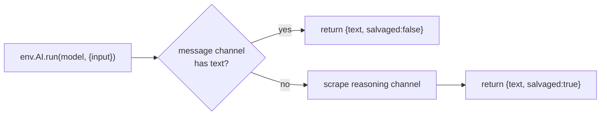
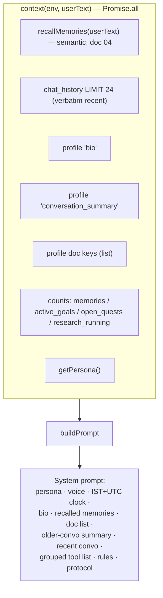
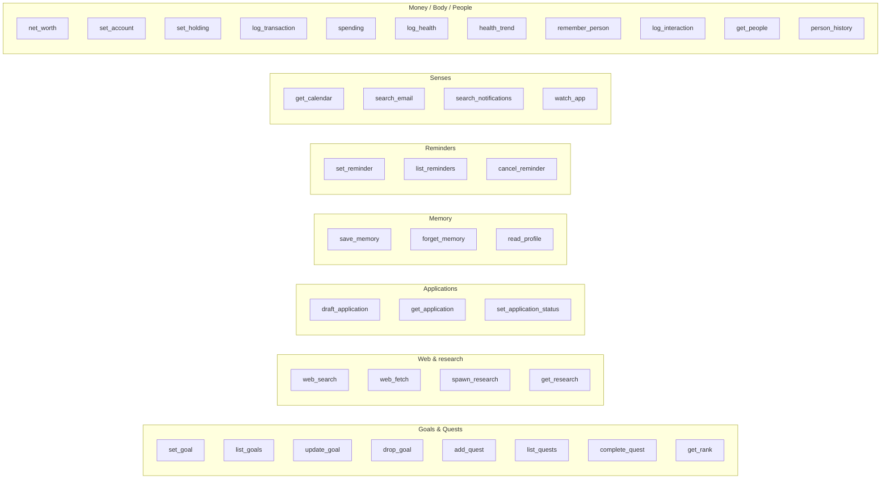
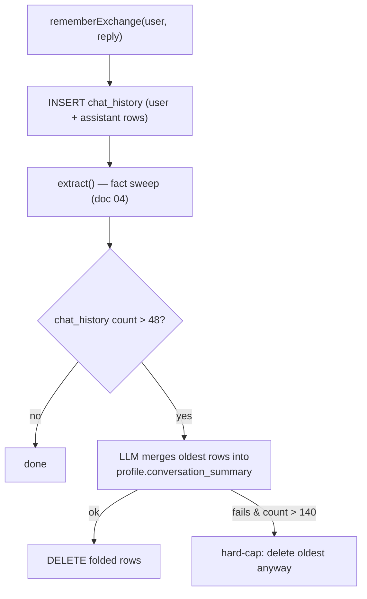

# 3. The Conversational Agent

This is the brain that answers when the owner talks. It's a **single-model JSON tool
loop** in `worker/src/agent.js`, backed by the LLM layer in `worker/src/llm.js`.

## 3.1 The loop at a glance

```mermaid
flowchart TB
  start["runAgent(env, userText)"] --> ctx["context() — assemble prompt inputs"]
  ctx --> loop{"for step in 0..MAX_STEPS-1 (8)"}
  loop --> call["llm(env, buildPrompt(...))"]
  call --> parse["extractJson(out) — last balanced {…}"]
  parse -->|no JSON| nudge["append 'broke protocol' note, keep clean prose as fallback"] --> loop
  parse -->|"{reply}"| done["return reply (≤3800 chars)"]
  parse -->|"{tool,args}"| run["TOOLS[tool].run(env, args)"]
  run --> append["transcript += call → result (≤2500 chars)"]
  append --> loop
  loop -->|"budget exhausted"| final["one protocol-free call:<br/>compose owner-facing answer from transcript"]
  final --> ret["return final (never raw loop prose)"]
```

Constants (`agent.js:9-12`): `MAX_STEPS = 8`, `HISTORY_ACTIVE = 24` (recent turns kept
verbatim), `HISTORY_COMPACT_AT = 48`, `HISTORY_HARD_CAP = 140`.

The loop is in `runAgent` (`agent.js:589`). Each iteration builds the *entire* prompt
fresh (there's no server-side conversation object — the model is stateless), calls the
LLM once, and interprets the reply as one JSON object.

## 3.2 The JSON protocol

The model must reply with **exactly one JSON object** (`agent.js:574-578`):

```
{"tool": "<name>", "args": {...}}   → run a tool, feed the result back
{"reply": "<message to the owner>"} → we're done, ship this
```

This is a hand-rolled ReAct-style loop, not a native function-calling API, because
Workers AI `gpt-oss-120b` is prompted through `env.AI.run` with a plain `input` string.
Two robustness mechanisms make it survive a model that doesn't always cooperate:

### `extractJson` — tolerate reasoning prose around the decision
`llm.js:24` scans for **every balanced `{…}` block** (tracking string/escape state) and
returns the **last** one that parses and carries `reply` or `tool`. Reasoning models
often narrate several brace-looking fragments before the real decision; taking the last
valid one is what makes that safe.

### The salvage flag — the gpt-oss reasoning-channel trap
`gpt-oss` sometimes stops *inside its reasoning channel* without emitting a final
message. `llm()` (`llm.js:6`) then pulls the text out of the `reasoning` output and
returns it, **but flags `salvaged: true`**:



Callers use the flag defensively: mid-loop, salvaged prose is **never shipped to the
owner** (it may be raw deliberation) — the loop keeps clean prose only as a last-resort
fallback and nudges the model to re-emit valid JSON (`agent.js:597-603`). Briefing,
weekly, perception and apply all treat `salvaged` as "came back malformed, try again".

### Out-of-budget handling
If all 8 steps pass without a `{reply}`, the loop makes **one final protocol-free call**
asking the model to compose an owner-facing answer from the transcript
(`agent.js:621`). This guarantees the owner never receives raw loop internals, even on
failure.

## 3.3 Prompt assembly

`buildPrompt` (`agent.js:533`) concatenates a large system prompt from `context()`
(`agent.js:493`), which runs seven queries in parallel:



Notable prompt construction details:

- **Dual clock.** `localNow()` (`agent.js:519`) computes the owner's **IST** date/time
  *and* the UTC time, and the prompt tells the model to reason about weekdays from the
  **local** date, never UTC (late-UTC-evening is already tomorrow in IST). "Friday" is
  defined as the next Friday on/after today. Reminder `due_at` must be UTC ISO — the
  prompt explicitly says "subtract 5:30 from Indian times" (`agent.js:563`).
- **Memory recall is by meaning, not recency** — only the memories relevant to *this*
  message are injected, with a note like "(14 recalled of 213 you hold)" so the model
  knows more exist (`agent.js:545`).
- **Persona** is injected as a name + optional voice block (`voiceBlock`), the same voice
  used across chat/briefing/weekly/overnight (see [07](./07-senses-life-initiative.md)).

## 3.4 The rules that constrain behaviour

The prompt's `## Rules` block (`agent.js`) encodes the product's hard-won invariants. The
ones that shape architecture:

- **Goals are everything.** With no active goals, the agent's first job is to extract them
  and `set_goal` them; it turns goal-moving intent into concrete `add_quest`s and pushes as
  a strict mentor rather than a cheerleader (see [05-the-system.md](./05-the-system.md)).
- **Don't spend a step saving memory** — every exchange is swept afterwards
  (see [04-memory.md](./04-memory.md)), so `save_memory` is only for explicit requests or
  derived facts the sweep can't see. This is the v3→v4 fix (§3.7).
- **Persist before replying.** When the owner states a balance, holding, weight, or a
  person detail, the agent must call the write tool *first*, then reply — doing the
  arithmetic "in its head" loses the data forever.
- **Never claim a side effect that didn't happen.** "NEVER say you saved/scheduled/
  watched something unless a tool call actually returned ok." A false "I've recorded it"
  is worse than admitting it didn't.
- **Quick vs deep.** `web_search`/`web_fetch` answer in seconds and reply now;
  `spawn_research` is for 10-minute questions and the agent must reply immediately that
  it's running, never wait.

## 3.5 The tool catalog

Tools are a flat map `TOOLS` (`agent.js`), extended with `...SYSTEM_TOOLS` (`system.js`),
`...APPLY_TOOLS` (`apply.js`) and `...LIFE_TOOLS` (`life.js`), then **grouped** for the
prompt via each tool's `group` + `toolList()` so the model finds the right shelf first.



Each tool is `{ desc, run(env, args) }`; `desc` is a one-liner including the exact args
shape, since the model reads it to decide the call. Highlights:

- **`web_search`** (`agent.js:55`) has a 3-tier fallback: Google CSE (if keyed) →
  DuckDuckGo HTML/lite endpoints (often block datacenter IPs) → Wikipedia opensearch as
  a last resort. This same tool is what the CI research agent *borrows* over HTTP
  (see [06](./06-research-agent.md)).
- **`web_fetch`** (`agent.js:113`) tries a direct fetch, then falls back to the
  `r.jina.ai` reader proxy.
- **`spawn_research`** (`agent.js:313`) enforces ≤3 in-flight jobs, inserts the row, and
  dispatches to GitHub Actions with only the id.

### The apply tools
`apply.js` turns any opportunity (URL / pasted JD / description) into a **ready-to-send
pack**. `draft_application` (`apply.js:75`): if given a URL it fetches and strips the
page, builds the owner profile from `resume`+`bio`+`skills`+memories, asks the LLM for a
structured JSON pack (honest `fit` 0–10, cover note, résumé bullets, likely Q&A,
"before you send" checklist), renders it to markdown, and stores it in `applications`.

### The life tools
`life.js` `LIFE_TOOLS` are the money/body/people tools. `net_worth` computes cash +
assets − owed (cards counted as debt); merchant categorisation asks the LLM once then
caches the pattern. Full detail in [07-senses-life-initiative.md](./07-senses-life-initiative.md).

## 3.6 Rolling memory of the conversation itself

Distinct from the *fact* memory (doc 04), the raw transcript is compacted so the prompt
never grows unbounded (`compactHistory`, `agent.js:629`):



Nothing is truly forgotten — old turns become dense summary bullets in
`profile.conversation_summary`, which is injected into every future prompt.

## 3.7 Why memory left the loop (the v3→v4 story)

Documented at the top of `memory.js`: in v3, `save_memory` was a tool *inside* the loop,
so remembering competed with answering — and the model almost always chose to answer. 12
hours of real conversation (a job lead, a whole thread about a person) produced **zero
memories**. v4 decouples them: the agent keeps `save_memory` for deliberate saves, but
**every exchange is also swept after the reply is sent**, where remembering costs the
owner nothing and can't lose a race. That sweep is the subject of the next doc.
