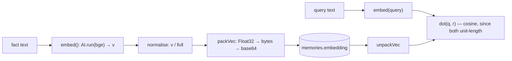
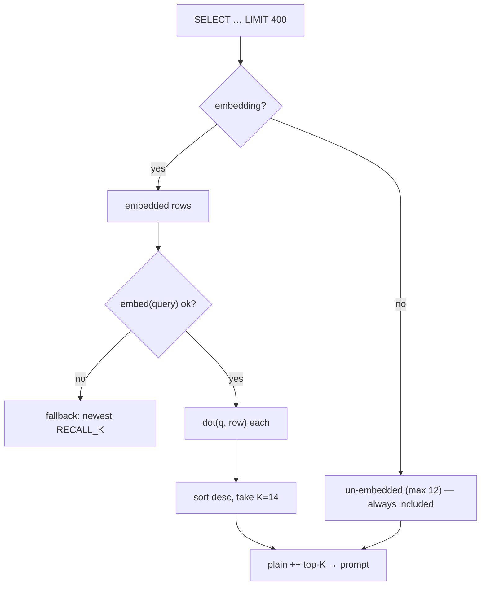
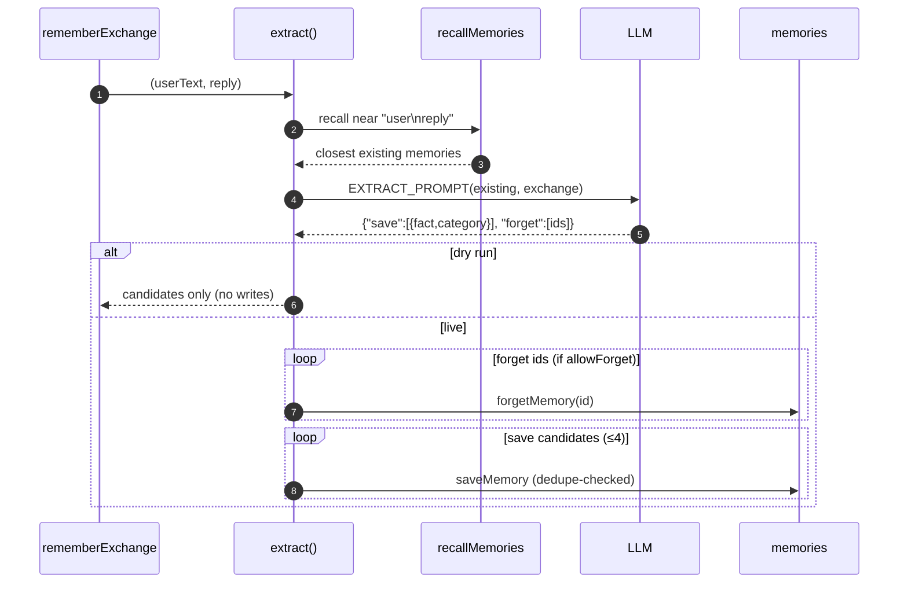
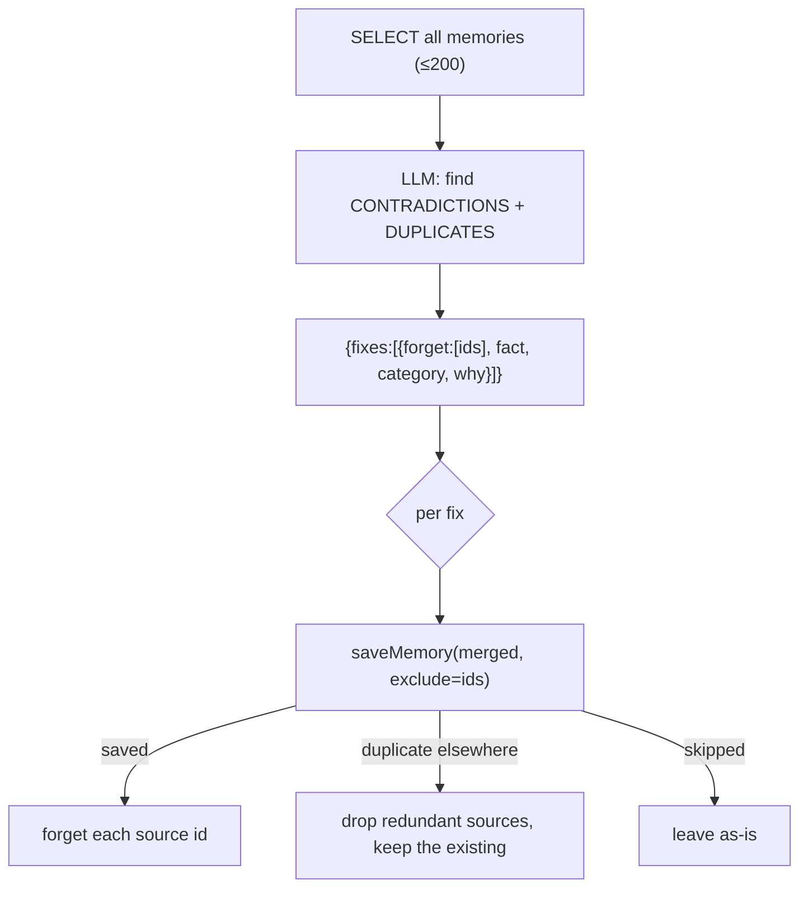
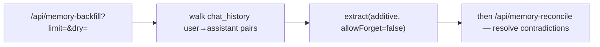
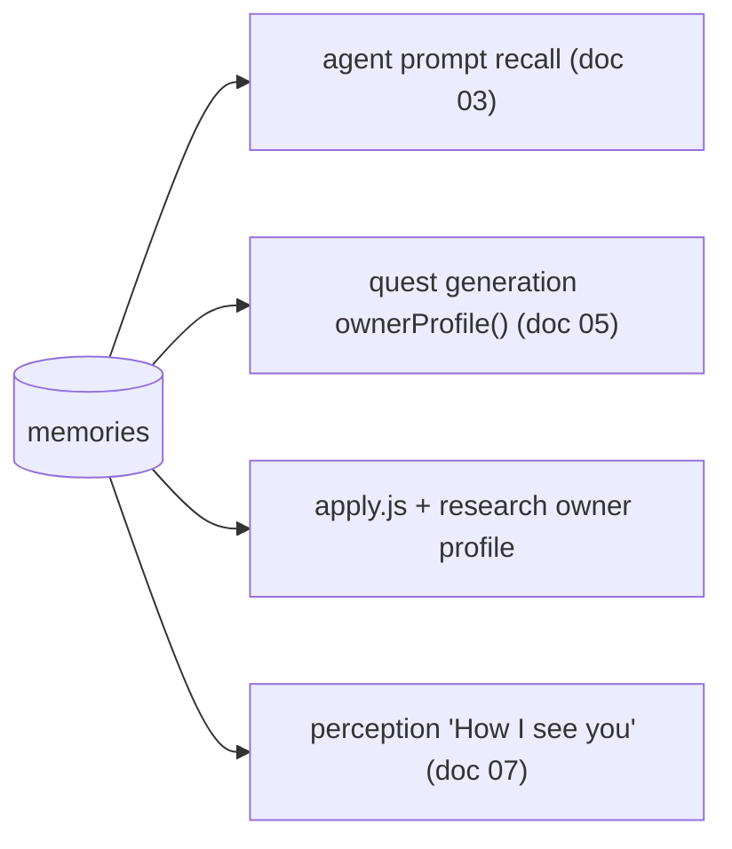

# 4. The Memory Subsystem

`worker/src/memory.js` is the agent's long-term memory of **the owner** (facts), lifted
out of the agent loop on purpose (see [03-agent.md §3.7](./03-agent.md#37-why-memory-left-the-loop-the-v3v4-story)).
It has four moving parts: **embed/recall**, **extract** (the post-reply sweep),
**reconcile** (whole-set audit), and **backfill** (replay old history).

## 4.1 Vectors: how facts are stored and matched

Each memory row carries an `embedding`: a **384-dim Float32 vector** from
`@cf/baai/bge-small-en-v1.5`, **normalised at write time and packed as base64**
(`memory.js:15-43`). Because vectors are unit-length, similarity is a plain **dot
product** — no per-query normalisation, no JSON array parsing (which would blow the
Worker's CPU budget).

Constants (`memory.js:16-18`): `RECALL_K = 14`, `NEAR_DUPLICATE = 0.90`.

## 4.2 Recall — by meaning, per turn

`recallMemories(env, query)` (`memory.js:54`) is called on every agent turn (and inside
`extract`). It:

1. Pulls the newest 400 memory rows.
2. Splits into **embedded** and **un-embedded** rows. Un-embedded rows (embedding failed,
   or predate v3) **always ride along** (up to 12) — "better a slightly bigger prompt
   than silently forgetting a fact."
3. Embeds the query; on failure, degrades gracefully to the newest `RECALL_K`.
4. Scores embedded rows by dot product, sorts, and returns `plain + top-K`.

## 4.3 Write & dedupe

`saveMemory` (`memory.js:97`) embeds the fact, then **dedupes on meaning, not string
equality**: if any existing embedded memory scores `≥ 0.90` cosine, it returns
`{status:"duplicate"}` instead of inserting (so "22 years old" and "is 22" collapse to
one). An `exclude` list lets a *reconciled* fact ignore its own sources when checking for
duplicates. If embedding fails, the fact is still stored **un-embedded** rather than lost.

## 4.4 Extract — the post-reply sweep

`extract(env, userText, reply, opts)` (`memory.js:180`) is the heart of v4. It runs
**after** the reply is already with the owner (called from `rememberExchange`, itself
often under `ctx.waitUntil`), so it can never block or lose a race against answering.

Design points:

- **`allowForget`** (`memory.js:180`): `true` live (the newest thing the owner said is by
  definition current, so it may supersede old memories); `false` when replaying history
  (§4.6), where "newest wins" is meaningless and would flip facts back and forth forever
  (the "21 vs 22" oscillation).
- **`dry`**: report what it *would* learn without writing — used before a backfill,
  because memory is the one table where a bad batch is painful to unpick by hand.
- **Robust JSON parse**: `extractJson` only accepts `{reply|tool}` shapes, so a second
  parser `parseMemoryJson` (`memory.js:227`) handles the `{save,forget}` shape.
- It **never throws into the caller** — the whole body is wrapped so a failed sweep is
  invisible to the owner (`memory.js:219`).

The prompt (`EXTRACT_PROMPT`, `memory.js:140`) instructs: save durable life facts
(identity, goals, projects, people, health, money, preferences, constraints, mentioned
opportunities), write each fact **standalone and third-person** so it survives with no
surrounding context, and never save pleasantries or pure questions. Categories are the 9
in `CATEGORIES` (`memory.js:18`).

## 4.5 Reconcile — auditing the whole set

`extract` only compares a *new* fact against what's held, so contradictions that arrived
separately just coexist. `reconcile` (`memory.js:259`) is the only pass that reads **all
memories at once** — the only vantage point from which "which of these two is true" is
answerable.

Critical ordering (`memory.js:275-288`): the merged fact is **written before** its
sources are deleted, with the sources excluded from the dup-check. Deleting first would
risk the merge being rejected as a copy of some third memory — dropping the originals and
keeping no merge. `?dry=1` previews; without it, this pass deletes.

## 4.6 Backfill — history from before the sweep existed

`backfill` (`memory.js:299`) replays `chat_history` that predates the post-reply
extractor. It walks user→assistant **pairs** (the same unit `extract` sees live) and runs
each through `extract` with `allowForget:false` (additive only). Contradictions among what
it learns are left to `reconcile`. Reached via `/api/memory-backfill` then
`/api/memory-reconcile` (see [08-api-and-ops.md](./08-api-and-ops.md)).

## 4.7 Where memory feeds back into the system

Memory isn't just recalled in chat — it's an input to The System, which is what makes
"tell the agent about yourself → get sharper quests" true:

Quest generation (`system.js` `ownerProfile`) reads goal/skill/project/identity memories
to pick concrete next steps, and the agent's own rules push the owner to tell it more so
the quests get sharper (`agent.js` Rules block). This is the same "the more it knows you,
the better it serves you" loop the old ranker had — now pointed at goals, not job boards.
