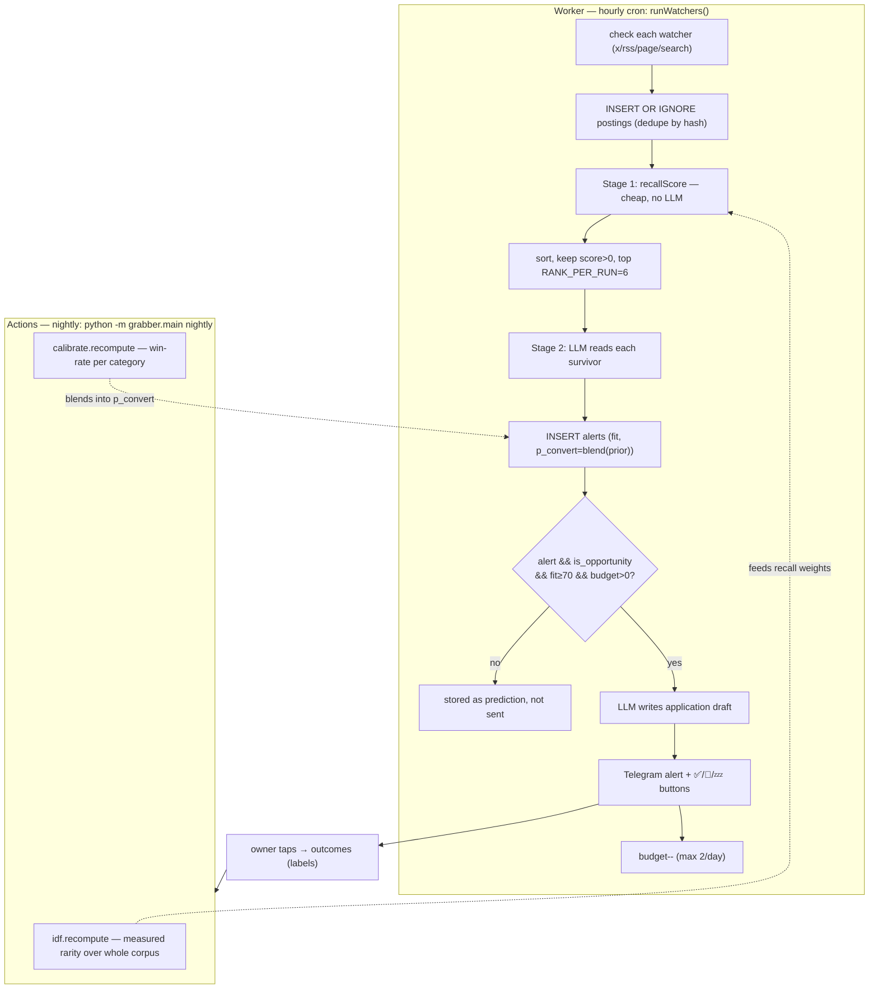
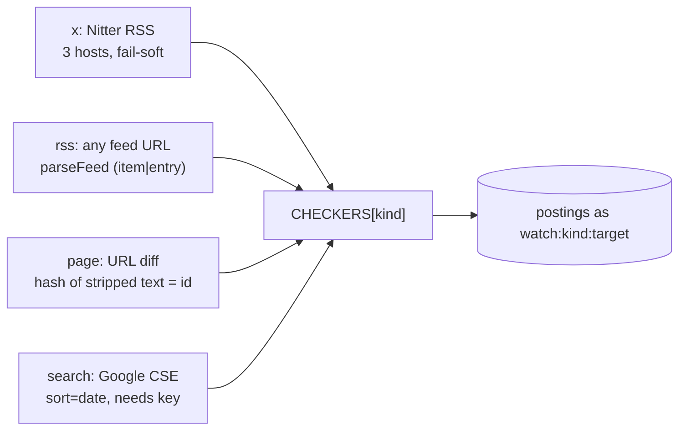
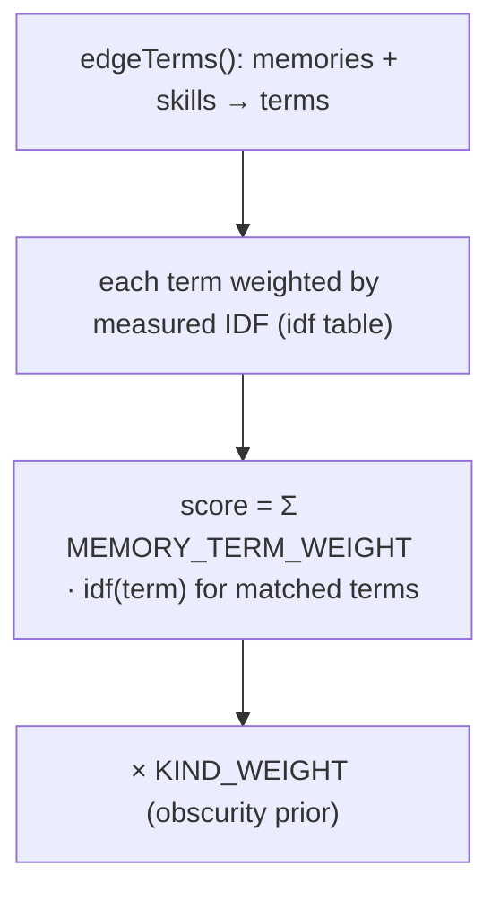
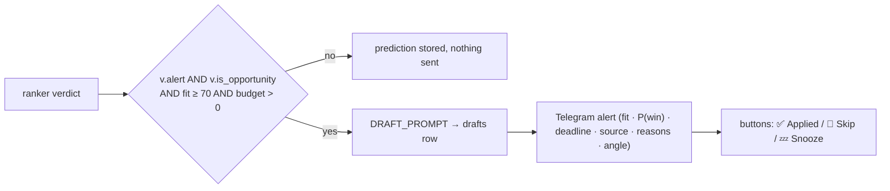
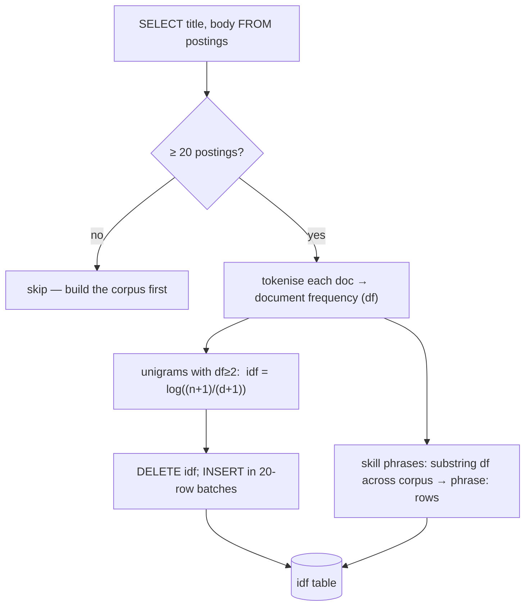
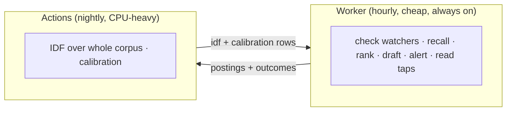

# 5. The Opportunity Engine

This is the system's original purpose: turn watched channels into a tiny number of
high-quality, pre-drafted alerts, and learn hit-rates over time. It spans
`worker/src/watch.js` (the live loop) and `pipeline/grabber/rank/{idf,calibrate}.py`
(the nightly learning).

## 5.1 End-to-end flow



The two-stage design (cheap recall → expensive LLM read) exists because the LLM budget
(free neurons) is the real constraint — you can't afford to read thousands of items.

## 5.2 Watchers replace the scraper

There is **no scraper**. The corpus is only what the owner explicitly asked to watch, so
`postings` — and therefore measured IDF rarity — describes material the owner *chose*, not
board noise (`watch.js:1-6`). Four watcher kinds, each with a checker returning
`[{external_id, title, body, url}]` (`watch.js:36-98`):



- **x** (`checkX`, `:59`) tries `nitter.net`, `nitter.poast.org`, `xcancel.com` in turn;
  each is flaky so failure is soft, and result URLs are rewritten back to `x.com`.
- **page** (`checkPage`, `:74`) is one item whose id is the **hash of its stripped
  text**, so it only re-fires when the page actually changes.
- Every checker failure is caught, recorded in `watchers.last_error`, and never kills the
  run (`watch.js:271`).

## 5.3 Stage 1 — recall scoring (no LLM)

`recallScore` (`watch.js:143`) scores each fresh item against the owner's **edge terms**
without any model call:



- `edgeTerms` (`watch.js:111`) pulls terms from **memories + the skills profile**, then
  looks up each term's IDF (unseen terms default to a neutral 1.0). Chunked at 50 to
  respect D1's 100-param limit.
- `MEMORY_TERM_WEIGHT = 0.25` (`watch.js:109`).
- **Obscurity prior** `KIND_WEIGHT = { x:1.5, rss:1.1, page:1.2, search:1.0 }`
  (`watch.js:18`) — a watched personal account is the whole point; a job board is where
  everyone already looked (design principle 2).

Only items with `score > 0` survive, and only the top `RANK_PER_RUN = 6` earn an LLM read
(`watch.js:282`) — the per-tick spend cap.

## 5.4 Stage 2 — the LLM reads survivors

For each survivor, `RANK_PROMPT` (`watch.js:155`) asks the model to judge **one item for
one person**, "brutally selective", returning JSON:

```json
{"category","is_opportunity","fit":0-100,"p_convert":0.0-1.0,
 "alert":true|false,"deadline","reasons","angle"}
```

The owner profile handed to it (`ownerProfile`, `:212`) is `bio`+`skills`+`resume` plus
owner-stated memories, which are marked **authoritative** — an item conflicting with a
stated preference should almost never alert.

Every judged item becomes an `alerts` row (a **logged prediction**) whether or not it's
sent — storing `fit`, the raw `llm_prior`, and the calibration-blended `p_convert`
(`watch.js:295`). A returned `deadline` back-fills `postings.deadline`.

## 5.5 The alert gate — silence is the product



Gates (`watch.js:11-12`, `:305`): `MIN_FIT_TO_ALERT = 70` and a hard
`MAX_ALERTS_PER_DAY = 2` budget, computed from alerts sent in the last 24h
(`alertsToday`, `:226`). Design principle 7: an alert that fires daily is an alert you
mute. When an alert *does* fire, the draft is already attached (principle 1 — the work
arrives done).

## 5.6 The prediction→label→calibration loop

This is design principle 4: "guess for a month, then know."

```mermaid
flowchart TB
  alert["alert sent — p_convert = predicted P(win)"] --> tap{"owner taps"}
  tap -->|✅ Applied| applied["outcomes: applied → then asks 🏆 Won / ❌ Rejected"]
  tap -->|🙅 Skip| skip["outcomes: skipped"]
  tap -->|💤 Snooze| snooze["outcomes: snoozed (deadline nag still fires)"]
  applied --> result{"result tap"}
  result -->|🏆| won["outcomes: won"]
  result -->|❌| rej["outcomes: rejected"]
  won --> calib
  rej --> calib
  calib["nightly calibrate.recompute:<br/>rate = won/(won+rejected) per category, null until n≥5"]
  calib --> blend["future p_convert = w·rate + (1-w)·prior,  w = n/(n+10)"]
```



- The **applied → won/rejected** two-step is driven entirely by button edits in the
  webhook (`worker/src/index.js:429-454`): tapping *Applied* swaps in the *Won/Rejected*
  buttons; a terminal tap clears them.
- **Calibration** (`calibrate.py:11`): per category, `rate` is null until `MIN_N_FOR_RATE
  = 5` decided outcomes; then it's `won/(won+rejected)`.
- **Blending** happens in two places with the same formula `w = n/(n+10)`
  (`BLEND_PSEUDO_N = 10`): the Worker's `blendedP` at alert time (`watch.js:232`) and the
  pipeline's `blend` (`calibrate.py:35`). Measured rate takes over as labels arrive.

## 5.7 Measured rarity — nightly IDF

Design principle 3: rarity is **measured, not asserted** — no hardcoded RARE dict to go
stale. `idf.recompute` (`idf.py:29`) runs nightly over the whole `postings` corpus:



- Two granularities: **unigram IDF** over everything (generic scoring + the dashboard's
  "rarest terms"), and **phrase DF** for each profile skill, since skills are often
  multiword ("computer vision") — stored under `phrase:` keys (`idf.py:56`).
- **Self-calibrating:** when a term starts appearing everywhere, its df rises, its idf
  collapses, and its contribution to a candidate's edge shrinks automatically.
- Skills come from the `skills` profile row parsed as YAML `phrase → proficiency`
  (`idf.py:70`).

## 5.8 Two runtimes, one engine — why it's split this way



The live decisioning is I/O-bound and belongs in the always-on Worker. The learning
(tokenise every posting; aggregate every outcome) is CPU-heavy batch work, so it's the
nightly Actions job. They meet only in D1: the Worker reads `idf`/`calibration`; the
pipeline reads `postings`/`outcomes`.
