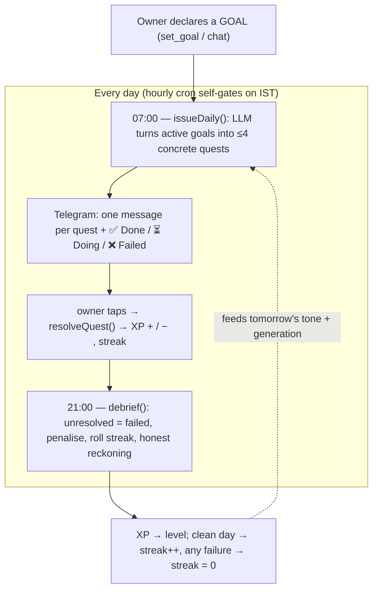
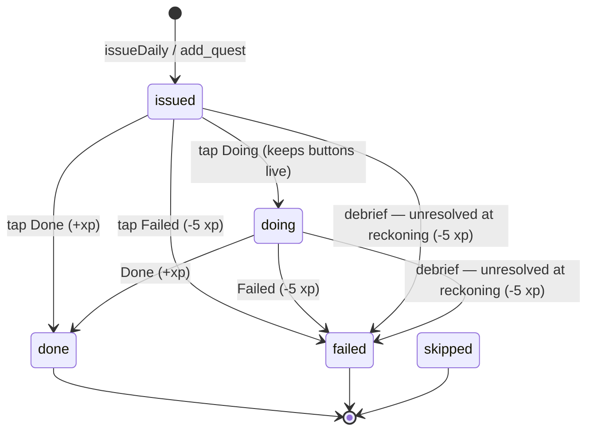
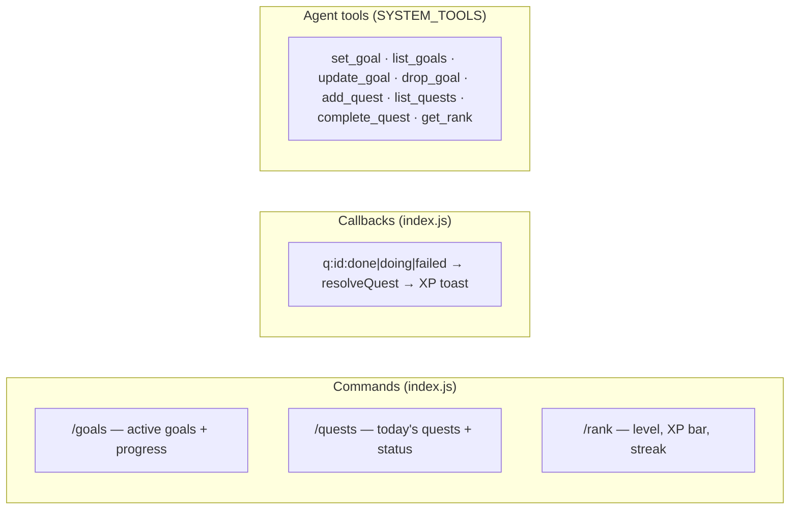

# 5. The System — the motive engine

This is grabber's spine: a strict mentor (modeled on the System from *Solo Leveling*)
whose single motive is to make the owner achieve their declared **goals**. It does not
wait for opportunities to appear — it drives the owner forward with daily **quests**,
accountability, penalties, and leveling. It **replaces the old job-board opportunity
engine** (watchers, IDF ranking, board alerts, calibration — all removed).

Code: `worker/src/system.js`. Tables: `goals`, `quests` (+ XP/level/streak in `state`).

## 5.1 The core loop



The old engine's *prediction → label → calibration* shape maps almost 1:1 onto
**quest → resolution → XP**, so this is a re-shaping of that idea, not a bolt-on.

## 5.2 Goals — the objective function

A `goals` row is a real objective: `title`, `why` (fuels the mentor's pushing),
`target` (measurable success), `deadline`, `status` (`active|achieved|dropped`).
Everything the System does is judged against active goals. Set them **three ways**: tell
the bot on Telegram (agent tool `set_goal`), the dashboard **System tab** "Set a goal" form
(`POST /api/goal` → `createGoal`), or `/goals` to view. Also `list_goals` / `update_goal` /
`drop_goal`; the dashboard has per-goal ✓done / drop buttons.

The agent's rules make goals load-bearing: if the owner has **no active goals**, its
first job is to extract them ("what are you trying to become, by when?") and `set_goal`
them; vague intentions must become a target + deadline or they don't count
(`agent.js` Rules block).

## 5.3 Quests — the daily unit of work

A `quests` row is one concrete, done-tonight action toward a goal: `goal_id` (nullable),
`text`, `kind` (`daily|milestone|urgent`), `status`
(`issued|doing|done|failed|skipped`), `xp`, `due_at` (defaults to end of the owner's
today, IST→UTC), `issued_at`, `resolved_at`, `tg_message_id`.



XP by kind (`system.js`): daily **+10**, milestone **+30**, urgent **+15**; a failure is
**−5** (`FAIL_PENALTY`). `resolveQuest(id, action)` is the single choke-point that writes
status and moves XP; only `done`/`failed` change XP, `doing` just keeps the quest open.

### Generation
`generateDailyQuests` (`system.js`) hands the LLM the active goals, recent quests (to
avoid repeats), and the owner profile (bio + skills + goal/skill/project memories), and
asks for **≤ `MAX_DAILY_QUESTS` (4)** concrete quests as JSON. Each becomes an `issued`
row. The prompt demands checkable-tonight actions, not busywork, and allows skipping a
goal that has no sensible step today.

## 5.4 Issuance & the reckoning

```mermaid
sequenceDiagram
  autonumber
  participant CRON as hourly cron
  participant SYS as system.js
  participant AI as Workers AI
  participant TG as Telegram
  participant DB as D1

  Note over CRON,SYS: 07:00 IST — issueDaily
  CRON->>SYS: runSystem()
  alt no active goals
    SYS->>TG: "The System has no goals for you" (Awakening)
  else
    SYS->>AI: generateDailyQuests(goals, recent, profile)
    AI-->>SYS: {quests:[…]}
    SYS->>DB: INSERT quests (issued)
    SYS->>TG: header + one message/quest with buttons
  end
  Note over CRON,SYS: 21:00 IST — debrief
  CRON->>SYS: runSystem()
  SYS->>DB: today's quests; unresolved → failed (-5 each)
  SYS->>DB: streak = allCleared ? +1 : 0 (+ streak_best)
  SYS->>AI: DEBRIEF_PROMPT(measured facts only)
  AI-->>SYS: hard, honest reckoning text
  SYS->>TG: "Reckoning — <date>"
```

- **The Awakening** (`issueDaily`): with zero active goals there is nothing to drive
  toward, so instead of quests it demands them — the thematic cold-start.
- **Once-a-day gates:** `state.system_last_issue` / `system_last_debrief` hold the IST
  date, so re-firing the same hour is a no-op. `runSystem` self-gates on `ISSUE_HOUR=7`
  and `DEBRIEF_HOUR=21`.
- **Numbers come from SQL, never the model.** Like the old briefing, `debrief` computes
  every figure (done/failed/streak/level) in code and only asks the LLM to write the
  sentence around them — and falls back to a plain templated line if the model salvages
  or returns empty.

## 5.5 Leveling & streaks

XP/level/streak live as `state` rows (`xp`, `level`, `streak`, `streak_best`).

- **Level curve** (`levelFor`/`xpForLevel`): level *N* needs `(N-1)² · 100` XP — L2@100,
  L3@400, L4@900, L5@1600…
- **Streak:** a *clean* day (≥1 done, 0 failed) extends it; **any** failure resets it to
  zero. `streak_best` records the high-water mark.
- Surfaced by `/rank` (a level bar + XP-to-next + streak), the `get_rank` agent tool, and
  `GET /api/rank`.

## 5.6 The strict-mentor voice

The default persona flipped from a neutral assistant to **The System**
(`persona.js` `DEFAULT_PERSONA`): cold, imperative, no flattery, never softens a real
number. `voiceBlock` now **always** injects the voice into prompts (chat, generation,
debrief) — previously it emitted only for a custom persona, which would have muted the
new default. The guardrail from the old design still holds and is now the point: *voice
is styling, never conduct* — it can't make the System lie about XP or a failed quest, and
`perception.js` still deliberately ignores the voice when giving its honest read.

## 5.7 Telegram & agent surfaces



Quest buttons carry `callback_data` `q:<id>:<action>`; the webhook routes `q:` to
`resolveQuest`, replies with a toast (`+10 XP · Level 3 — LEVEL UP`, or
`−5 XP. Do better tomorrow.`), and clears the buttons on a terminal action (keeps them on
`doing`). Reminder buttons (`r:`) are unchanged; the old alert `a:` buttons are gone.

## 5.8 The activity log & dashboard

Every meaningful move The System makes is recorded in the `activity` table via
`logActivity()` (`system.js`): a goal set, quests issued, a quest cleared or failed, the
nightly reckoning, a research job spawned (`agent.js`), an application drafted
(`apply.js`). The dashboard's **System tab** reads this through `GET /api/system`
(rank + goals + today's quests + the newest 60 activity rows) and renders it as a
"what I'm doing to hit your goals" feed — so the owner can see, at a glance, what the
agent has actually done for them. The dashboard (`worker/public/index.html`) opens on the
**System** tab (rank hero, the honest "How I see you" read, quests, goals, activity,
applications). Other tabs: **Brain** (an explorable knowledge graph — zoom/pan/click-to-
focus/legend-filter/search — plus memories, conversation, reminders), **Life**,
**Research**, **Senses**, and **Settings** (persona, teach, profile documents). The old
Opportunities tab was removed.

## 5.9 What changed from the opportunity engine

| Removed | Replaced by |
|---------|-------------|
| `watch.js` watchers (x/rss/page/search), board ranking, alerts, drafts, deadline nags | `system.js` goals + quests + issuance + reckoning |
| `idf.py` measured rarity, `calibrate.py` win-rates, the whole `nightly.yml` job | XP/level/streak in `state` (computed in the Worker; no CPU job needed) |
| `/stats` `/pending` `/applied` `/watchers` commands | `/goals` `/quests` `/rank` |
| board agent tools (`search_corpus`, `add_watcher`, `get_draft`, …) | `SYSTEM_TOOLS` |

The `applications` pack feature (`apply.js`), research, senses, memory, money/body/people
and reminders all remain — they are now the mentor's **levers** for getting things done
toward a goal, not standalone features. The now-inert engine tables (`postings`, `idf`,
`alerts`, `outcomes`, `drafts`, `calibration`) are left in place for one more cleanup pass
so the dashboard keeps working; see [08-api-and-ops.md](./08-api-and-ops.md).
