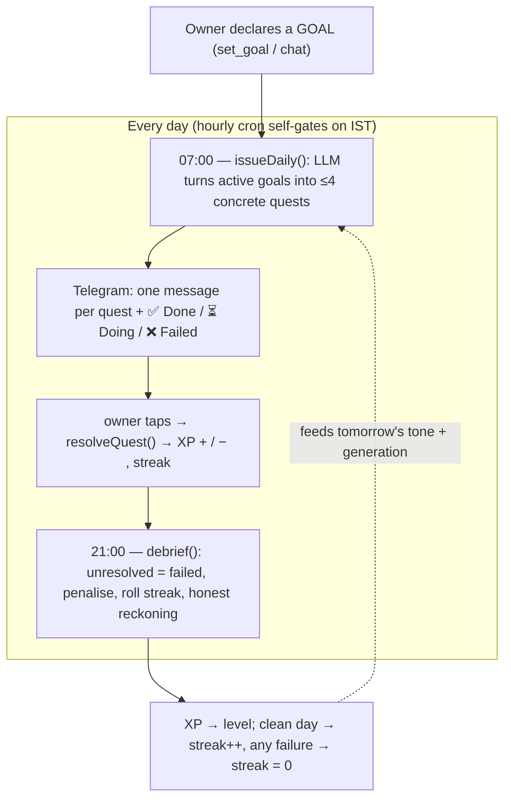
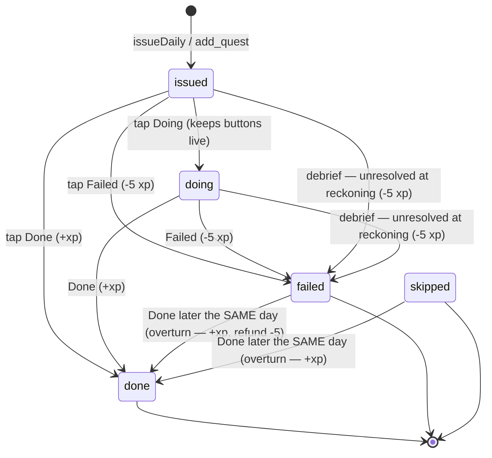
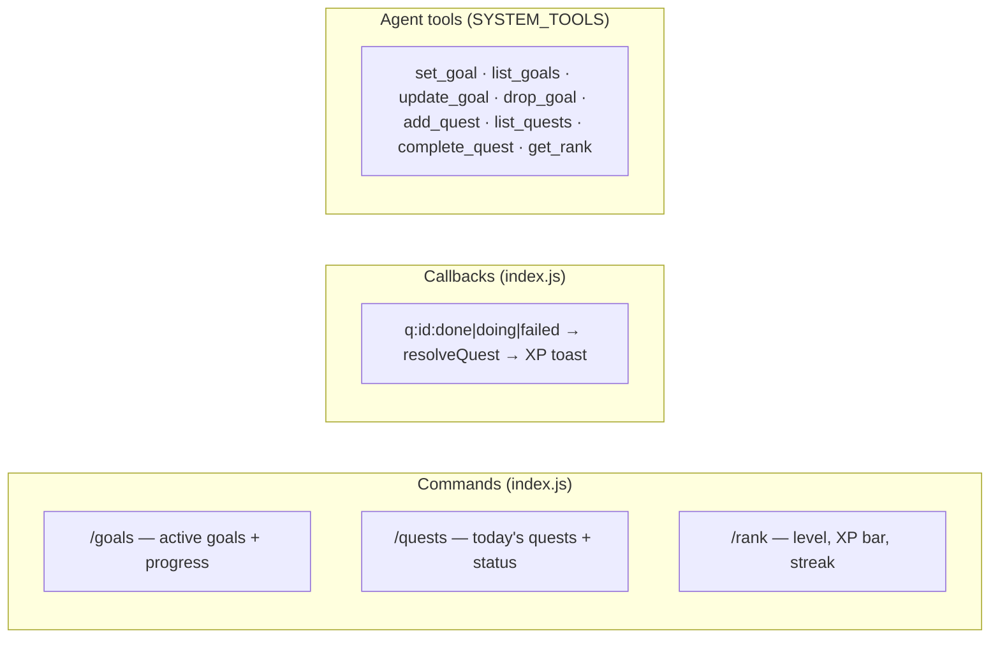

# 5. The System — the motive engine

This is grabber's spine: a strict mentor (modeled on the System from *Solo Leveling*)
whose single motive is to make the owner achieve their declared **goals**. It does not
wait for opportunities to appear — it drives the owner forward with daily **quests**,
accountability, penalties, and leveling. It **replaces the old job-board opportunity
engine** (watchers, IDF ranking, board alerts, calibration — all removed).

Code: `worker/src/system.js`. Tables: `goals`, `quests` (+ XP/level/streak in `state`).

## 5.1 The core loop



The old engine's *prediction → label → calibration* shape maps almost 1:1 onto
**quest → resolution → XP**, so this is a re-shaping of that idea, not a bolt-on.

## 5.2 Goals — the objective function

A `goals` row is a real objective: `title`, `why` (fuels the mentor's pushing),
`target` (measurable success), `deadline`, `status` (`active|achieved|dropped`).
Everything the System does is judged against active goals. Set them **three ways**: tell
the bot on Telegram (agent tool `set_goal`), the dashboard **System tab** "Set a goal" form
(`POST /api/goal` → `createGoal`), or `/goals` to view. Also `list_goals` / `update_goal` /
`drop_goal`; the dashboard has per-goal ✓done / drop buttons.

The agent's rules make goals load-bearing: if the owner has **no active goals**, its
first job is to extract them ("what are you trying to become, by when?") and `set_goal`
them; vague intentions must become a target + deadline or they don't count
(`agent.js` Rules block).

## 5.3 Quests — the daily unit of work

A `quests` row is one concrete, done-tonight action toward a goal: `goal_id` (nullable),
`text`, `kind` (`daily|milestone|urgent`), `status`
(`issued|doing|done|failed|skipped`), `xp`, `due_at` (defaults to end of the owner's
today, IST→UTC), `issued_at`, `resolved_at`, `tg_message_id`.



XP by kind (`system.js`): daily **+10**, milestone **+30**, urgent **+15**, side **+5**
(a small supporting action — prep, habit, recovery — that makes the main quests easier); a failure is
**−5** (`FAIL_PENALTY`). `resolveQuest(id, action)` is the single choke-point that writes
status and moves XP; only `done`/`failed` change XP, `doing` just keeps the quest open.

**Overturning** (`overturnQuest`): a terminal status is locked, *except* `done` landing on
a `failed`/`skipped` quest resolved earlier the **same IST day**. The reckoning runs at
21:00 IST and auto-fails everything unresolved, but the owner often clears quests (or taps
✅) later that night — before this rule their Done silently bounced off the auto-fail
(`already: failed`) and the quest stayed failed forever. The flip re-awards the quest's XP,
refunds the −5 penalty for a fail, and — if the day is now clean — restores the streak the
reckoning broke, using the pre-reckoning value `debrief` stashes in `state.streak_prev` /
`streak_prev_date`.

### Generation
`generateDailyQuests` (`system.js`) hands the LLM the active goals — each with its current
milestone **and that milestone's planned `steps`** — recent quests (to avoid repeats; steps
already covered by past quests count as done), and the owner profile, and asks for
**≤ `MAX_DAILY_QUESTS` (4)** concrete quests as JSON. Main quests are issued from the
milestone's **next unfinished steps** (resized to fit one day), and the model may add one
`side` quest — a low-stakes supporting action (+5 XP) that makes the main quests easier.
Each becomes an `issued` row. The prompt demands checkable-tonight actions, not busywork,
and allows skipping a goal that has no sensible step today.

## 5.4 Issuance & the reckoning

```mermaid
sequenceDiagram
  autonumber
  participant CRON as hourly cron
  participant SYS as system.js
  participant AI as Workers AI
  participant TG as Telegram
  participant DB as D1

  Note over CRON,SYS: 07:00 IST — issueDaily
  CRON->>SYS: runSystem()
  alt no active goals
    SYS->>TG: "The System has no goals for you" (Awakening)
  else
    SYS->>AI: generateDailyQuests(goals, recent, profile)
    AI-->>SYS: {quests:[…]}
    SYS->>DB: INSERT quests (issued)
    SYS->>TG: header + one message/quest with buttons
  end
  Note over CRON,SYS: 21:00 IST — debrief
  CRON->>SYS: runSystem()
  SYS->>DB: today's quests; unresolved → failed (-5 each)
  SYS->>DB: stash streak_prev, then streak = allCleared ? +1 : 0 (+ streak_best)
  SYS->>AI: DEBRIEF_PROMPT(measured facts only)
  AI-->>SYS: hard, honest reckoning text
  SYS->>TG: "Reckoning — <date>"
```

- **The Awakening** (`issueDaily`): with zero active goals there is nothing to drive
  toward, so instead of quests it demands them — the thematic cold-start.
- **Once-a-day gates:** `state.system_last_issue` / `system_last_debrief` hold the IST
  date, so re-firing the same hour is a no-op. `runSystem` self-gates on `ISSUE_HOUR=7`
  and `DEBRIEF_HOUR=21`.
- **Numbers come from SQL, never the model.** Like the old briefing, `debrief` computes
  every figure (done/failed/streak/level) in code and only asks the LLM to write the
  sentence around them — and falls back to a plain templated line if the model salvages
  or returns empty.

## 5.5 Leveling & streaks

XP/level/streak live as `state` rows (`xp`, `level`, `streak`, `streak_best`).

- **Level curve** (`levelFor`/`xpForLevel`): level *N* needs `(N-1)² · 100` XP — L2@100,
  L3@400, L4@900, L5@1600…
- **Streak:** a *clean* day (≥1 done, 0 failed) extends it; **any** failure resets it to
  zero. `streak_best` records the high-water mark. A same-day overturn that leaves the day
  clean restores the broken streak from `streak_prev` (see §5.3).
- Surfaced by `/rank` (a level bar + XP-to-next + streak), the `get_rank` agent tool, and
  `GET /api/rank`.

## 5.6 The strict-mentor voice

The default persona flipped from a neutral assistant to **The System**
(`persona.js` `DEFAULT_PERSONA`): cold, imperative, no flattery, never softens a real
number. `voiceBlock` now **always** injects the voice into prompts (chat, generation,
debrief) — previously it emitted only for a custom persona, which would have muted the
new default. The guardrail from the old design still holds and is now the point: *voice
is styling, never conduct* — it can't make the System lie about XP or a failed quest, and
`perception.js` still deliberately ignores the voice when giving its honest read.

## 5.7 Telegram & agent surfaces



Quest buttons carry `callback_data` `q:<id>:<action>`; the webhook routes `q:` to
`resolveQuest`, replies with a toast (`+10 XP · Level 3 — LEVEL UP`, or
`−5 XP. Do better tomorrow.`), and clears the buttons on a terminal action (keeps them on
`doing`). Reminder buttons (`r:`) are unchanged; the old alert `a:` buttons are gone.

## 5.8 The activity log & dashboard

Every meaningful move The System makes is recorded in the `activity` table via
`logActivity()` (`system.js`): a goal set, quests issued, a quest cleared or failed, the
nightly reckoning, a research job spawned (`agent.js`), an application drafted
(`apply.js`). The dashboard's **System tab** reads this through `GET /api/system`
(rank + goals + today's quests + the newest 60 activity rows) and renders it as a
"what I'm doing to hit your goals" feed — so the owner can see, at a glance, what the
agent has actually done for them. The dashboard (`worker/public/index.html`) opens on the
**System** tab (rank hero, the honest "How I see you" read, quests, goals, activity,
applications). Other tabs: **Brain** (an explorable knowledge graph — zoom/pan/click-to-
focus/legend-filter/search — plus memories, conversation, reminders), **Life**,
**Research**, **Senses**, and **Settings** (persona, teach, profile documents). The old
Opportunities tab was removed.

## 5.85 Planner, autonomy & progress (the roadmap upgrade)

The System no longer regenerates a fresh to-do list each morning — a goal now has a
persistent, time-aware plan it drives. Four capabilities, all in `system.js`:

- **Temporal context** — `clockContext(env, goal)` returns code-computed facts (today in
  IST, `goal_age_days` from `created_at`, `days_to_deadline`, `runway_used_pct`,
  `days_since_last_cleared`, streak) and is spread into *every* reasoning prompt (planner,
  quest generation, the ponder tick, the reckoning). Never guessed by the model.
- **Persistent roadmap** — `planGoal()` decomposes a goal into 3–6 ordered `milestones`
  with `target_date`s across the runway (runs once on goal-create, lazily at issuance, or
  via `replan_goal`). The planner (and `adaptPlan`) reasons over `goalContext(env, goal)`:
  the static owner profile, **plus** memories recalled by embedding against the goal's
  title/target/why, **plus the latest measured numbers** from the `health` and `metrics`
  logs — so it plans from where the owner actually is (it knows they own a Yamaha Pacifica
  and weigh what their last log says; it won't tell them to buy a guitar or "gain weight"
  in the abstract). The prompts enforce **specificity**: every milestone measurable and
  concrete (exact numbers/named things, no abstract labels), and each carries `steps` —
  3-6 concrete day-sized actions (stored as JSON, migration 006) that are the raw material
  for daily quests. `generateDailyQuests` issues from the **active** milestone's next
  unfinished steps; clearing its quests auto-advances the milestone (`advanceMilestones`).
  `createGoal` dedups on active title (case-insensitive) so the agent re-hearing a goal in
  chat can't create a second active copy.
- **Goal-level progress** — `computeProgress` writes `goals.progress` = (done milestones +
  active-milestone quest ratio) / total; `paceOf` compares it to runway elapsed →
  `ahead / on-track / behind / at-risk` + a projected completion date. Pure SQL + arithmetic.
- **Autonomous action** — `autonomyTick` (cron at `AUTONOMY_HOUR = 13` IST) is a bounded
  self-directed reasoning pass: it picks **one** move (research a blocker, surface a
  finding, nudge, or propose a re-plan), gated by mode (`off | suggest | act`, default
  suggest), a daily `AUTONOMY_BUDGET = 3`, quiet hours (`22:00–07:00`), and research dedup.
  Every move is logged `actor='system'` with its `reasoning`, shown `AUTO`-tagged in the
  feed. Owner controls the mode from **Settings** (`POST /api/settings`).

`runSystem` now fires three self-gated slots: issue (07:00), ponder (13:00), reckoning
(21:00). The dashboard renders each goal's progress bar, pace chip, projected date, and
its milestone roadmap. Full design: the roadmap artifact linked from the project notes.

**Adaptive planning.** A roadmap isn't static — `adaptPlan()` re-personalizes it to real
progress: it **keeps the completed milestones** and re-tunes only what's left (reshaping
scope/titles, re-spacing dates for the remaining runway, simplifying when behind), reasoning
over the same `goalContext` owner profile + goal-relevant memories as the planner. It runs
four ways: **on quest completion** — a ✅ (Telegram button, via `ctx.waitUntil` so the toast
never waits on the LLM, or the `complete_quest` tool) fires `maybeAdaptOnDone`, gated by a
4-hour per-goal cooldown so a burst of taps costs one call; the **debrief** re-tunes *every*
goal that failed a quest today, is behind/at-risk, or hit a milestone (capped at 3/night,
6-hour cooldown); the **"Adapt to progress"** button (`POST /api/goal {id,adapt}`); and the
agent tool `adapt_plan`. Every successful adapt stamps a shared `adapt_last_<id>` state key,
so the triggers never re-tune a freshly-tuned plan, and logs `plan_adapt` with its reasoning.
(Distinct from `replanGoal`, which throws the whole roadmap away and maps a fresh one.)

**The Plans tab** is a consolidated widget: each goal as a horizontal **timeline** (milestone
dots positioned by target date, a progress fill vs a "today" marker so drift is visible),
progress %, pace chip, projected date, the milestone list — the **active milestone's steps
shown open** (today's marching orders), other milestones' steps collapsed behind an
"N steps" fold — and Adapt / Re-plan buttons. The tab makes the whole mechanism legible:
a **"How a plan drives you"** explainer at the top (steps → morning quests → milestone fill
→ goal %, and when the reckoning re-tunes), a per-goal **"Why this route"** block showing
the planner's own reasoning (latest `plan`/`plan_adapt` activity, served as
`plan_reasoning`/`plan_at` on each goal in `/api/system`), and a **"Today's quests"**
section inside each plan card linking today's quests to the active milestone, with a note
on how much of the goal each milestone is worth.

## 5.86 The planner asks back (plan questions)

A mature plan is built on facts the System may not hold — a waist measurement, hours
genuinely free, equipment, budget, current skill level. Both planner prompts now end with
an **"ASK WHAT YOU'RE MISSING"** clause: produce the best plan anyway, and emit up to 3
short `questions` when a missing fact would materially change the route. The lifecycle
(`plan_questions` table, migration 008):

1. **Asked** — `recordPlanQuestions` stores them (≤3 open per goal, ≤5 asked per goal per
   24h — answered questions trigger re-plans which ask more, and without the daily cap the
   loop became an endless intake interview; case-insensitive dedup against everything ever
   asked for that goal; `goalContext` lists open ones back to the planner as "do NOT
   re-ask", and the prompts forbid re-asking a topic answered even approximately).
2. **Announced** — `announceOpenQuestions(env, tg)` pings the owner. Never-announced
   questions go out on **every hourly cron tick** (plus immediately after goal creation
   and every adapt path), so an ask reaches the owner within the hour it arose; quiet
   hours defer to the next non-quiet tick. The morning issuance also re-pings **stale**
   open questions (ignored 2+ days; `announced` counts the nags, capped at 3).
3. **Answered** — three ways, all landing in `answerPlanQuestion`: the owner replies in
   chat (open questions ride in every agent prompt with instruction to call the
   `answer_plan_question` tool once per answered question, even in passing), the Plans tab
   (one input per question, ONE "Save answers → re-plan" button per goal →
   `POST /api/plan-question {answers:[{id,answer}]}`; `{id,dismiss:true}` waves one off),
   or the agent tool directly. The answer is stored on the row, saved as an `identity`
   **memory** (so all future recall knows it), and logged as `plan_question` activity.
   **Re-planning fires once, not per answer**: the chat path re-plans automatically when a
   goal's *last* open question is answered (`replan:"auto"`); the dashboard batch records
   every answer first, then runs one `adaptPlan` per distinct goal even if some questions
   stayed open. Answers that never trip a re-plan still reach the planner through
   `goalContext` at the next adapt.

`goalContext` feeds answered Q&A into every subsequent plan/adapt as its highest-signal
facts. Open questions surface in `/api/system` (`plan_questions`) and via the
`list_plan_questions` tool.

## 5.87 Awards

XP rewards a day; **awards** reward the arc. The `awards` table (migration 007) holds
one-time recognitions — `key` is UNIQUE and grants go through `grantAward` with
`INSERT OR IGNORE`, so every check is idempotent. Each grant adds bonus XP, logs an
`award` activity, and announces on Telegram (suppressed in quiet hours — the badge still
lands silently). `checkAwards` (`system.js`) is pure SQL and runs **nightly in the
debrief** (after the streak/progress are final; tonight's earnings feed the reckoning
message as `awards_earned_tonight`) and **after every ✅** (via `ctx.waitUntil`, so quest
totals and rank promotions land the moment they're crossed). Manual trigger:
`/api/cron?awards=1`. The catalog:

- **Streaks** — 3 (Ignition 🔥), 7, 14, **30 (30 Days of Discipline 🏆)**, 60, 100 days.
- **Quests cleared** — 10 / 50 / 100 / 250 totals.
- **Hunter ranks** — `rankTitle(level)` maps the level to E/D/C/B/A/S rank (D at L3, C at
  L5, B at L7, A at L9, S at L11); each promotion is an award (+40 XP) and the current
  title shows in the dashboard's rank hero and `/api/rank`.
- **First Gate Cleared** — first milestone ever completed.
- **Goal Achieved** — per achieved goal (+100 XP).
- **30-Day Transformation** (+50 XP, per goal) — the "I did 30 days and see visible
  change" award: the goal is ≥30 days old, ≥12 of its quests cleared in the last 30 days,
  and either route progress ≥20% or a goal-linked metric measurably moved (first → last
  value in the window, quoted in the award detail).

Awards surface on the **System tab** (Awards card + 🏆 count in the rank hero) and via the
`list_awards` agent tool.

**Metrics & trends.** Two logs feed the dashboard's charts. **Body/habit** numbers (weight,
waist, sleep, runs, workouts) go to `log_health` (the `health` table) and chart on the
**Life → Trends** section — a line per level metric, bars per count metric. **Everything
else** moving toward a goal (MRR, leetcode solved, minutes practiced) goes to `log_metric`
(the `metrics` table) and charts on the **System** tab. The agent's rules route each kind
to the right log so it forms one series over time.

Both sections share one interactive chart (`drawTrend` in `public/index.html`): a
**time-proportional x-axis** (uneven logging reads as uneven — an index-based x would lie
about pace), y gridlines with value labels, first/last date labels, hover **crosshair +
tooltip** (exact value, IST timestamp), and a **7d/30d/90d/All range row** that scopes
every card in the section. Count series are **bucketed per IST day** (entries sum into one
bar; hovering lifts the bar). Charts draw at real pixel width and redraw on resize; an
all-positive series never pads its domain below zero.

**Re-planning caveat:** because `quests.milestone_id` FKs `milestones(id)`, `replanGoal()`
detaches quests (`milestone_id = NULL`) *before* deleting the old milestones — a raw
`DELETE FROM milestones` fails the foreign-key constraint once quests reference them.

## 5.9 What changed from the opportunity engine

| Removed | Replaced by |
|---------|-------------|
| `watch.js` watchers (x/rss/page/search), board ranking, alerts, drafts, deadline nags | `system.js` goals + quests + issuance + reckoning |
| `idf.py` measured rarity, `calibrate.py` win-rates, the whole `nightly.yml` job | XP/level/streak in `state` (computed in the Worker; no CPU job needed) |
| `/stats` `/pending` `/applied` `/watchers` commands | `/goals` `/quests` `/rank` |
| board agent tools (`search_corpus`, `add_watcher`, `get_draft`, …) | `SYSTEM_TOOLS` |

The `applications` pack feature (`apply.js`), research, senses, memory, money/body/people
and reminders all remain — they are now the mentor's **levers** for getting things done
toward a goal, not standalone features. The now-inert engine tables (`postings`, `idf`,
`alerts`, `outcomes`, `drafts`, `calibration`) are left in place for one more cleanup pass
so the dashboard keeps working; see [08-api-and-ops.md](./08-api-and-ops.md).
