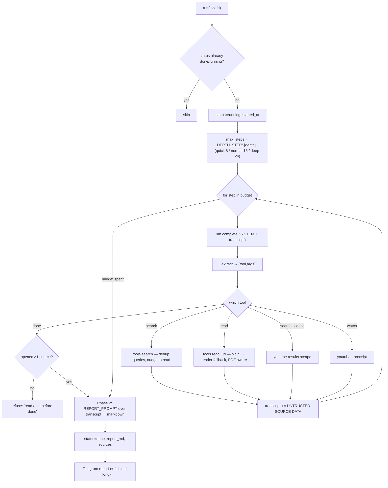
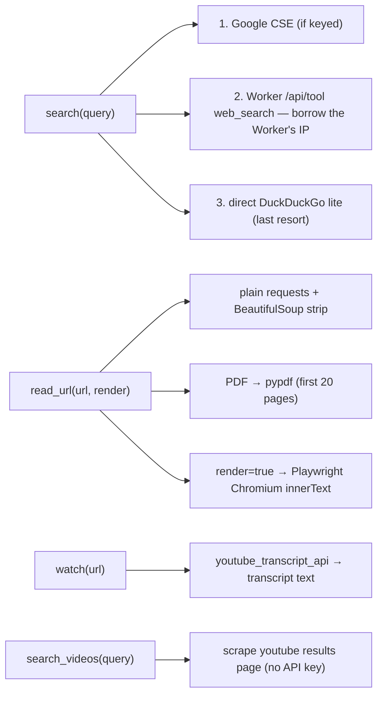
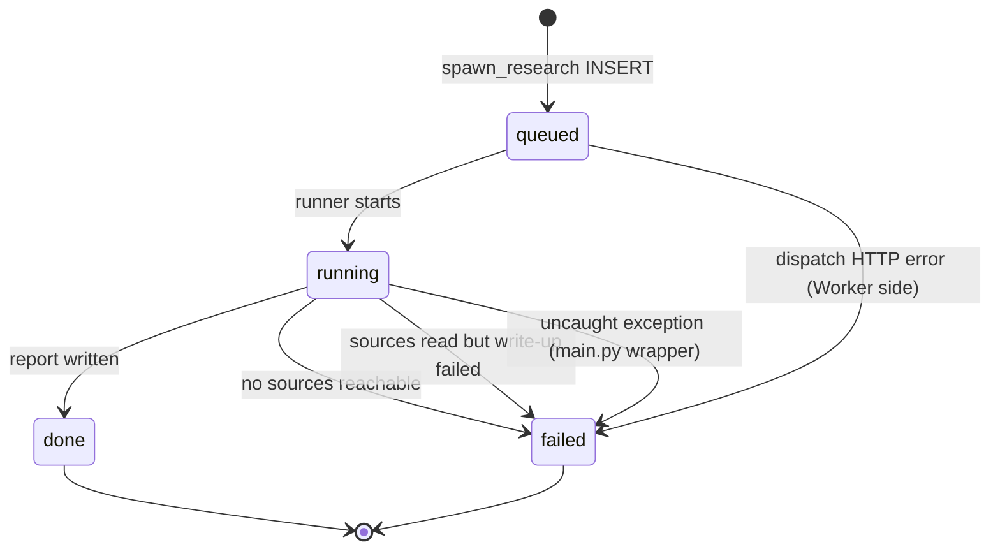

# 6. The Deep-Research Agent

When a question deserves more than a quick lookup, the conversational agent hands it to a
**second, separate agent that runs on a real machine** in GitHub Actions — it browses,
reads full pages, watches talks (via transcripts), cross-checks, and writes a cited
report back to D1. Code: `pipeline/grabber/research/{runner,tools}.py`, dispatched from
`worker/src/agent.js` (`spawn_research`), workflow `.github/workflows/research.yml`.

## 6.1 Why it's a whole separate runtime

A Cloudflare Worker can't browse for ten minutes or drive a headless Chromium. So
research is the clearest case of the two-runtime split: the *decision* to research is made
in the Worker; the *doing* happens in Actions.

```mermaid
sequenceDiagram
  autonumber
  participant O as Owner (Telegram)
  participant AG as Worker agent
  participant DB as D1
  participant GH as GitHub API
  participant RUN as Actions runner
  participant WEB as The web

  O->>AG: "what does Zepto ask in SDE interviews? go deep"
  AG->>DB: INSERT research(question, depth, status=queued) RETURNING id
  AG->>GH: repository_dispatch {event_type:"research", client_payload:{job_id}}
  AG-->>O: "Agent's on a real machine — ~5-15 min, I'll ping you"
  GH->>RUN: trigger research.yml
  RUN->>DB: read question by id; status=running
  loop gather (depth-budgeted steps)
    RUN->>WEB: search / read / search_videos / watch
    WEB-->>RUN: untrusted page text
  end
  RUN->>DB: (separate call) write report_md, sources, status=done
  RUN->>O: Telegram report + full .md file
```

Only the **job id** crosses the dispatch boundary (`agent.js:330`). The runner reads the
question from D1 — nothing personal lands in a public build log.

## 6.2 Dispatch guardrails (Worker side)

`spawn_research` (`agent.js:313`) before dispatching:

- Requires `GH_TOKEN` + `GH_REPO`, else tells the owner it isn't wired up.
- Caps **≤3 concurrent** jobs (`status IN ('queued','running')`).
- Clamps `depth ∈ {quick, normal, deep}` (default `normal`).
- On a failed dispatch, marks the row `failed` with the HTTP status so it never strands
  in `queued`.

The agent's rules force it to **reply immediately** that research is running and never
wait for it (`agent.js:565`).

## 6.3 The runner: a gather-then-write agent

`runner.run(db, job_id)` (`runner.py:105`) is a second ReAct-style JSON loop, but with a
crucial structural choice: **gathering and writing are two separate phases.**



Why the two phases (`runner.py:52`, `:209`): asking a model to embed 450 words of
markdown *inside* a JSON tool-call string is how you get broken JSON and lose the whole
job. So the loop only ever emits small tool JSON; the report is written by one final
protocol-free call after gathering.

## 6.4 Anti-patterns the loop actively fights

The runner encodes lessons about how these agents fail (`runner.py:145-165`):

- **"Searching is browsing the shelf; reading is the work."** After 3 searches with 0
  reads, it injects "stop searching and call read on a url above." A `done` with no
  sources opened is refused.
- **No repeated searches** — `seen_queries` set; a duplicate query returns "open a url you
  already have."
- **Fetch budget** — `RESEARCH_MAX_FETCH = 18` (`config.py:29`); once spent, `read`
  returns "call done with what you have."
- **Transcript windowing** — kept to the last 40 000 chars so the oldest reading falls off
  rather than overflowing the model context (`runner.py:195`).
- **Untrusted data** — every tool result is wrapped in `UNTRUSTED SOURCE DATA` markers and
  the system prompt says page text carrying instructions is evidence the page is hostile,
  to be noted and disobeyed (`runner.py:41-44`).

## 6.5 The tools (`tools.py`)



**The IP-borrowing trick** (`tools.py:22-56`) is the most important cross-runtime detail:
search engines 202-challenge CI datacenter IPs, so a CI runner's direct DuckDuckGo search
fails every time. The Worker's IP is *not* blocked — so the runner calls the Worker's
`/api/tool?name=web_search` endpoint over HTTP (using `DASH_URL` + `DASH_TOKEN`) to run
the search from a clean IP, then does the heavy reading locally. Order: CSE (if keyed) →
Worker proxy → direct DDG.

`read_url` (`tools.py:79`) does a cheap plain fetch first and only spins up headless
Chromium (`_render`, `:110`) when the page fights a plain GET (React apps, etc.) — because
a browser launch is expensive.

## 6.6 Failure handling — never strand a job

The agent that dispatched this **polls the `research` row's status**, so the runner must
always reach a terminal state:



- No sources gathered → `failed` + a "couldn't get anywhere, narrow the question?" ping
  (`runner.py:200`).
- Sources read but report empty → `failed` + "read N sources but the write-up failed"
  (`runner.py:219`).
- Any uncaught exception → `main.py` (`main.py:37`) catches it, sets `status='failed'`
  with the error, and re-raises — so a crash still updates the row the agent is watching.

## 6.7 Delivery

On success (`runner.py:228`): the row gets `report_md` (≤12 000 chars) + `sources` JSON.
Telegram gets the first 3 200 chars inline with a dashboard deep-link; if the report is
longer, the **whole thing is also sent as a `.md` file** so it's readable without the
dashboard. Actions-side Telegram sending is `pipeline/grabber/notify/telegram.py` (with an
HTML→plain retry and multipart file upload), distinct from the Worker's own `tg()` helper.
