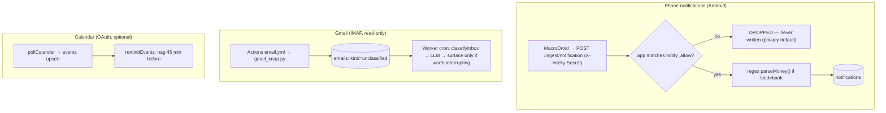
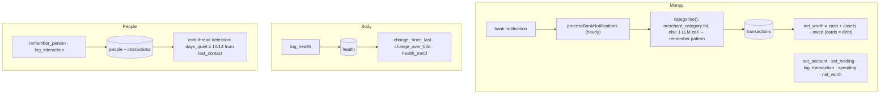
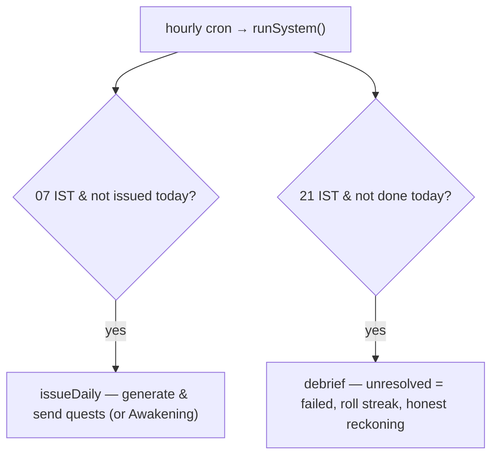
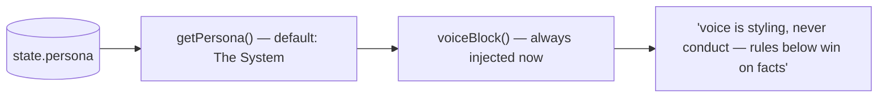
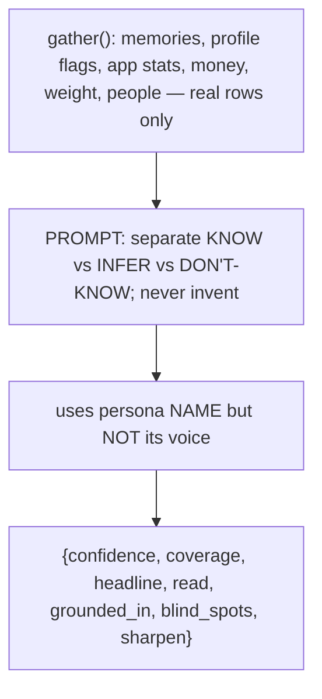

# 7. Senses, Life, and Initiative

Three layers around The System: **senses** (things it learns without being told), **life**
(money/body/people it holds for the owner), and **initiative** — which is now The System's
quest loop (§7.3). Plus the two things that shape *how* the mentor speaks: **persona** and
**perception**.

Files: `worker/src/senses.js`, `worker/src/life.js`, `worker/src/system.js`,
`worker/src/persona.js`, `worker/src/perception.js`. Setup guide: [`senses.md`](./senses.md).

## 7.1 Senses — input without asking

### Phone notifications (`senses.js:35`)
The bridge posts **every** notification; the Worker stores only those whose `app+title`
matches a `notify_allow` pattern — everything else is dropped in memory and never touches
the DB (`senses.js:1-6`, `allowFor` at `:29`). Bank notifications are parsed with a
**regex, not a model call** (`parseMoney`, `:18`) — bank alerts are formulaic, so a model
would be waste. The phone bridge has its own `NOTIFY_SECRET` (§1.6). iPhone can't do this
(iOS forbids reading notifications); money there falls back to Gmail statements + telling
the bot directly.

### Gmail (`gmail_imap.py` + `senses.js:162`)
IMAP with an **App Password** — deliberately chosen over OAuth because `gmail.readonly`
over OAuth forces either a weeks-long verification review or a token that dies every 7
days (`gmail_imap.py:1-9`, and see `scripts/google_auth.py` header). The mailbox is opened
**readonly** — no STORE/MOVE/EXPUNGE/DELETE, so it can't even mark mail read. A narrow
Gmail search (`GMAIL_SEARCH`, `:22`) fetches only recruiter/opportunity mail from the last
2 days, ignoring promotions/social. Actions writes it `unclassified`; the Worker's cron
runs `classifyInbox` → `surfaceEmail` (`:194`), which asks the LLM and only interrupts the
owner if a **real person wants something or a real deadline is attached**
(`worth_interrupting`).

### Calendar (`senses.js:96`)
Optional, OAuth-gated (`googleConnected`, `:78`) — off by default. `pollCalendar` upserts
the next 7 days of events; `remindEvents` nags 45 minutes before an event
(`reminded` flag prevents repeats). One refresh token drives it.

## 7.2 Life — money, body, people

All Worker-only (public-repo boundary, `life.js:1-7`). Exposed as `LIFE_TOOLS` on the
agent (doc 03).

- **Money.** `processBankNotifications` (`life.js:41`) turns parsed bank notifications into
  `transactions`. `categorise` (`:18`) checks the learned `merchant_category` map first,
  and only on a miss asks the LLM for one word — then **remembers the pattern forever**.
  `net_worth` (`:62`) treats card balances as money owed.
- **Body.** `log_health` (`:184`) stores a metric and immediately returns the trend
  (change since last, change over 60d) — "a number alone is trivia; the trend is the
  point."
- **People.** `log_interaction` (`:263`) updates `last_contact` and resets status to
  active; `get_people {cold:true}` (`:289`) surfaces threads quiet ≥10 days, measured from
  `last_contact` **or** `created_at` — so someone you added and never followed up with
  still surfaces (relying on `log_interaction` always firing would silently miss people).

The agent's rules bind these together: **persist a stated number before replying**, never
invent a figure, and `log_interaction` whenever a person is named (`agent.js:569-572`).

## 7.3 Initiative — now The System

Initiative used to be a *briefing/weekly/overnight* trio governed by "silence is the
product" — it interrupted **rarely**. The System **inverts** that: a strict mentor pushes
**daily**. The old `briefing.js` is gone; initiative is now the quest loop in
`system.js` — morning issuance and a nightly reckoning — fully documented in
[05-the-system.md](./05-the-system.md).

What carried over from the old design:

- **Numbers come from SQL, never the model.** The nightly `debrief` computes every figure
  (done/failed/streak/level) in code and only asks the LLM to write the sentence around
  them — the same discipline the old briefing used.
- **Self-gating + once-a-day idempotency** via `state` date rows
  (`system_last_issue`/`system_last_debrief`).

What deliberately changed: the **"only speak if it changes the owner's day" gate is gone**
for the daily quest issue — the daily push *is* the point. The mentor is relentless (one
quest set + one reckoning), not silent. (Overnight self-directed research is not part of
this spine; it can be re-added to `system.js` later.)

## 7.4 Persona — one voice everywhere

`persona.js`: a single `state.persona` row (name + voice) read by **every** prompt that
speaks to the owner — chat, quest generation, the reckoning, perception — so the voice is
consistent. The **default persona is now The System**: a cold, imperative strict mentor
(`DEFAULT_PERSONA`). `voiceBlock` was changed to **always** inject the voice (it used to
emit only for a custom persona) — otherwise the new default voice would never reach the
prompts.

The header of `persona.js` records a **measured** boundary: a persona explicitly ordered to
invent numbers still answered "0 applications" (facts held), **but** a flattering voice
made it *soft* — it once rewrote a perception to drop "he hasn't applied to anything yet."
Conclusion: voice can't make it lie, but it can make it soft. For The System that boundary
is a feature — a strict voice that still can't fake XP or a failed quest — and it's why
perception ignores the voice (next section). Owner input is sanitised (braces/backticks
stripped) because the agent parses replies as one JSON object (`clean`).

## 7.5 Perception — "How I see you"

`perception.js`: the agent's honest, self-authored read of the owner, generated on demand
(a dashboard button), cached in `state.perception`.

Honesty is enforced by **structure**: the model must split what it KNOWS (backed by rows)
from what it INFERS from what it DOESN'T know, and with a thin brain the only honest output
is "I barely know you" (`perception.js`). It deliberately uses the persona's name but
**ignores its voice** — "what do you actually think of me" is worthless if the person
asking picked the tone of the answer.

> Note: `perception.js` still gathers the old alerted-vs-applied counts (from the now-inert
> engine tables). It's the natural place to surface The System's real accountability signal
> — goals set vs quests actually cleared, streaks kept vs broken — in the next pass.
