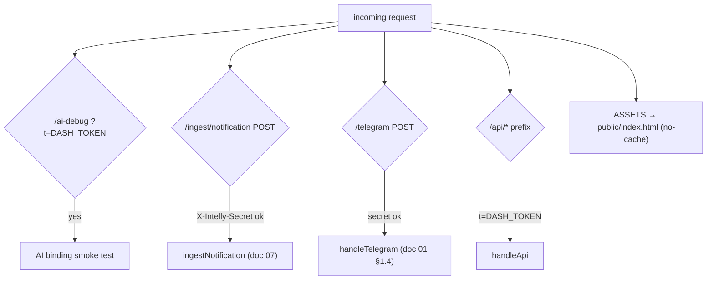
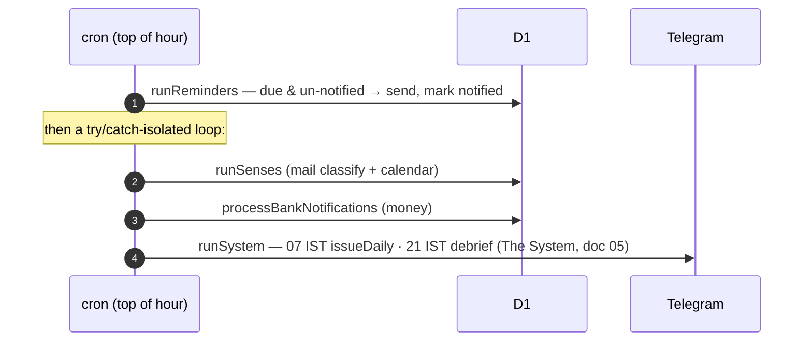
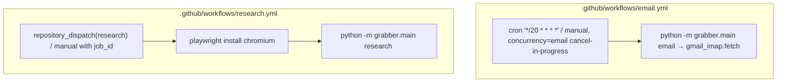
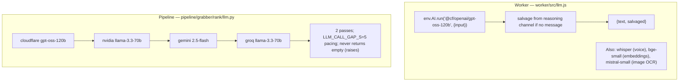
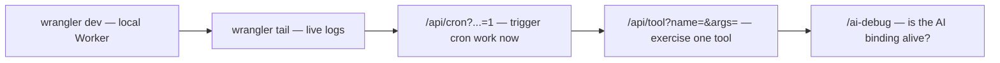

# 8. API & Operations Reference

Every externally-reachable surface, the cron sequence, the Actions workflows, and the LLM
provider chain — the operational map of the system.

## 8.1 Worker HTTP routes

All under `worker/src/index.js`. `fetch` dispatches in this order (`:823`):

### Public / secret-gated
| Route | Method | Auth | Purpose |
|-------|--------|------|---------|
| `/telegram` | POST | `X-Telegram-Bot-Api-Secret-Token` = `TG_WEBHOOK_SECRET` | The bot webhook — chat, media, button taps. |
| `/ingest/notification` | POST | `X-Intelly-Secret` = `NOTIFY_SECRET` | Phone notification bridge. |
| `/ai-debug` | GET | `?t=DASH_TOKEN` | Runs one `gpt-oss-120b` call to confirm the AI binding. |
| `/` and assets | GET | none | The dashboard SPA (`public/index.html`), served `Cache-Control: no-cache`. |

### Dashboard API (`/api/*`, all require `?t=DASH_TOKEN`, `handleApi` at `:551`)
| Route | Method | Purpose |
|-------|--------|---------|
| `/api/brain` | GET | The whole dashboard payload: memories, persona, chat, reminders, docs, summary, research, life (accounts/holdings/spend/people/health/transactions), applications, merchants, perception, senses — plus **legacy** engine fields (watchers, rarity, calibration, alerts) that now return empty until the dashboard is reshaped. |
| `/api/teach` | POST | Paste text → memory `extract` (doc 04). `{text, dry}`. |
| `/api/persona` | POST | Set/reset the persona (doc 07). |
| `/api/memory` | POST / DELETE | Add a fact / delete by `?id`. |
| `/api/profile` | POST | Upsert/delete a profile document (resume/bio/skills/notes). |
| `/api/profile-read` | GET | Read one profile doc by `?key`. |
| `/api/memory-backfill` | GET | Replay `chat_history` into memory. `?limit`, `?dry=1`. |
| `/api/memory-reconcile` | GET | Whole-set contradiction/duplicate audit. `?dry=1`. |
| `/api/embed-backfill` | GET | Give pre-v3 memories their vectors (batch of 50); also mirrors them into Vectorize. |
| `/api/vector-backfill` | GET | Push every D1-held vector into the Vectorize index (batches of 100). Run once after creating the index; idempotent rebuild path (doc 04 §4.1). |
| `/api/perception` | GET | Cached read, or `?refresh=1` to regenerate. |
| `/api/mail-status` | GET | What the IMAP job delivered + awaiting classification. |
| `/api/tool` | GET | **Run one agent tool directly** — `?name=&args=<json>`, applying the same `validateArgs` boundary check as the agent loop (doc 03 §3.5). This is also what the CI research agent calls to borrow the Worker's IP for `web_search` (doc 06). |
| `/api/cron` | GET | Manually trigger cron work — flags `?senses=1&system=1&issue=1&debrief=1&force=1` (`issue`/`debrief` force one half of The System). |
| `/api/rank` | GET | The System's level/XP/streak + active goals. |
| `/api/system` | GET | The dashboard **System tab** payload: `rank` (level/XP/streak), `goals` (each with `progress`, `pace`, `projected`, and its `milestones` roadmap), `quests_today`, `activity` (the work log, newest 60, with `actor`/`reasoning`), and `settings` (autonomy mode + budget). |
| `/api/goal` | POST | Set a goal (`{title,…}` → `createGoal`, which also maps the roadmap), change status (`{id,status}`), or re-map the roadmap (`{id,replan:true}`). Powers the dashboard's "Set a goal" form and per-goal buttons. |
| `/api/settings` | POST | `{autonomy_mode: off\|suggest\|act}` — the dashboard's autonomy control. |

> **Security note:** `DASH_TOKEN` gates *both* the read dashboard and mutating endpoints
> (`/api/teach`, `/api/memory`, `/api/persona`, `/api/cron`, `/api/tool`). It is a
> capability token — treat it like a password.

## 8.2 Telegram bot commands

Handled by `handleCommand` (`index.js:163`); non-owners are refused on everything but
`/start`.

| Command | Shows |
|---------|-------|
| `/start` | Your `chat_id` (to set `TELEGRAM_CHAT_ID`) + help. |
| `/goals` | active goals + per-goal quest progress. |
| `/quests` | today's quests and their status. |
| `/rank` | level, XP bar, and streak. |
| `/memories` | what it knows about you + profile docs. |
| `/research` | recent deep dives + status. |
| `/help` | capability overview. |

Everything that isn't a command is treated as conversation (or media) and goes to the
agent loop (doc 03).

## 8.3 The hourly cron sequence

`scheduled()` (`index.js:862`), trigger `"0 * * * *"`:

Each of the six looped jobs is wrapped so one failure logs and continues (`index.js:875`).
Reminders and nags run *before* the loop because they're cheap and must never be starved.

## 8.4 GitHub Actions workflows

Two workflows remain — the old `nightly.yml` (IDF + calibration) was removed with the
opportunity engine.

- **email** — every 20 min, `concurrency: {group: email, cancel-in-progress: true}` so
  slow runs don't stack. Passes `GMAIL_ADDRESS`/`GMAIL_APP_PASSWORD`.
- **research** — event-driven (`repository_dispatch` from the Worker, or manual with a
  `job_id`). Installs Chromium; passes `DASH_URL`/`DASH_TOKEN` for the IP-borrow search
  proxy. Timeout 25 min. **Prints only progress + URLs**, never owner content (public
  logs).

Entry point for both: `python -m grabber.main <cmd>` (`pipeline/grabber/main.py`):
`email` | `research <job_id>`.

## 8.5 The LLM provider chain

Two different LLM layers, one per runtime — both default to the same model but differ in
fallback strategy.

- **Worker** (`llm.js`): Workers AI only, single model, with the salvage flag (doc 03 §3.2).
  Multimodal models are called directly in `index.js` (Whisper `:199`, Mistral `:220`) and
  `memory.js` (bge `:24`).
- **Pipeline** (`rank/llm.py`): Cloudflare primary, then NVIDIA → Gemini → Groq
  (`PROVIDERS`, `:81`), each tried twice, gapped by `LLM_CALL_GAP_S=5` to respect free-tier
  RPM. `complete()` **never returns None/empty — it raises**, so callers can't be
  surprised (the "gpt-oss reasoning-channel" salvage is handled here too, `:53`). Model IDs
  and keys live in `pipeline/grabber/config.py`.

## 8.6 Secrets & config inventory

| Name | Where set | Used for |
|------|-----------|----------|
| `CF_ACCOUNT_ID`, `CF_API_TOKEN` | Worker binding + Actions secrets | D1 REST + Workers AI (pipeline). |
| `D1_DB_ID` | Actions secret | D1 REST target (`db.py`). |
| `TELEGRAM_BOT_TOKEN`, `TELEGRAM_CHAT_ID` | Worker secret + Actions | Bot API + owner gate. |
| `TG_WEBHOOK_SECRET` | Worker secret | `/telegram` auth. |
| `DASH_TOKEN` | Worker secret + Actions | `/api/*` + research IP-borrow. |
| `NOTIFY_SECRET` | Worker secret | `/ingest/notification` auth. |
| `GH_TOKEN`, `GH_REPO` | Worker secret + `wrangler.toml` var | `spawn_research` dispatch. |
| `GOOGLE_CSE_ID` / `GOOGLE_CSE_KEY` | var / secret | `web_search` primary backend. |
| `GMAIL_ADDRESS` / `GMAIL_APP_PASSWORD` | Actions var/secret | IMAP poll. |
| `GOOGLE_CLIENT_ID/SECRET/REFRESH_TOKEN` | Worker secret | Calendar (optional). |
| `GEMINI_API_KEY`, `GROQ_API_KEY`, `NVIDIA_API_KEY` | Actions secret | Pipeline LLM fallbacks. |

The authoritative Worker list is the `wrangler.toml` header (`:29-40`); the pipeline list
is `pipeline/grabber/config.py`.

## 8.7 Operating runbook

- **Issue/debrief The System now:** `GET /api/cron?t=…&system=1&force=1` (or `&issue=1` /
  `&debrief=1` for one half); `&senses=1` for mail/calendar.
- **Check rank:** `GET /api/rank?t=…`.
- **Test one agent tool:** `GET /api/tool?t=…&name=web_search&args={"query":"…"}`.
- **Re-run a research job manually:** Actions → research → Run workflow → the `job_id`.
- **Re-sync schema from prod:**
  `wrangler d1 execute grabber --remote --command "SELECT sql FROM sqlite_master"`.
- **No tests / no linter** — verify by driving the real surfaces above.
