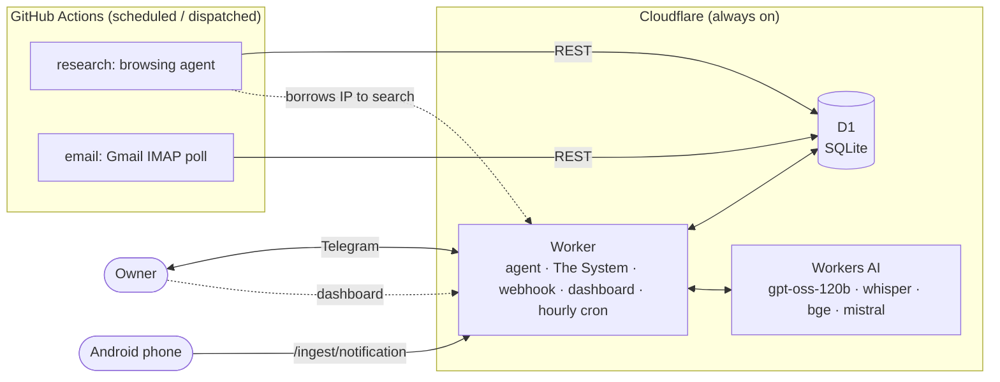

# grabber — architecture documentation

This folder is the deep, implementation-grounded design reference for grabber. Every
statement here is traced to real code; where a number or rule matters, the source file
is cited as `file:line`. If code and doc ever disagree, the code wins — fix the doc.

> For the product story and the 7 design principles, read the top-level [`README.md`](../README.md).
> For working in the code day-to-day, read [`CLAUDE.md`](../CLAUDE.md).
> For wiring up the optional senses (phone + Google), read [`senses.md`](./senses.md).

## What grabber is, in one paragraph

grabber is a $0-infrastructure **personal agent for one owner** — a strict mentor called
**The System** (in the *Solo Leveling* sense) whose one motive is to drive the owner to
their declared **goals**. It issues daily **quests**, holds a nightly reckoning, penalises
failure, and levels the owner up — and doubles as a general life agent (money, calendar,
mail, people, health, reminders, research). It lives in Telegram, thinks with free-tier
LLMs, and remembers the owner in a vector-recalled memory.

## The documents

| # | Doc | What it covers |
|---|-----|----------------|
| 1 | [01-architecture.md](./01-architecture.md) | **HLD.** The two-runtime topology, the shared database, every request and cron flow, the security/privacy boundaries, deployment. |
| 2 | [02-data-model.md](./02-data-model.md) | All 25 D1 tables, the ER diagram, which runtime owns what, and the schema-drift history. |
| 3 | [03-agent.md](./03-agent.md) | The conversational agent: the JSON tool-loop, prompt assembly, the tool catalog, the LLM call layer and the gpt-oss salvage trap. |
| 4 | [04-memory.md](./04-memory.md) | The memory subsystem: embeddings, semantic recall, the post-reply extraction sweep, reconcile, backfill. |
| 5 | [05-the-system.md](./05-the-system.md) | **The motive engine.** Goals → daily quests → tap-to-resolve → XP/level/streak → nightly reckoning; the strict-mentor voice. Replaces the old opportunity engine. |
| 6 | [06-research-agent.md](./06-research-agent.md) | The deep-research agent that runs on a real machine in GitHub Actions: dispatch, gather/write phases, IP borrowing. |
| 7 | [07-senses-life-initiative.md](./07-senses-life-initiative.md) | Senses (phone, Gmail, calendar), money/body/people, and the persona/perception that shape the mentor's voice. |
| 8 | [08-api-and-ops.md](./08-api-and-ops.md) | Every Worker HTTP route, the hourly cron sequence, the Actions workflows, and the LLM provider chain. |

## The 30-second mental model

Two runtimes, one database. The Worker is the brain and does almost everything — including
The System's quest loop; GitHub Actions exists only for the two jobs that still need a real
machine (minutes for browsing, IMAP for mail). The old nightly IDF/calibration job went
away with the opportunity engine. See [01-architecture.md](./01-architecture.md) for why.
